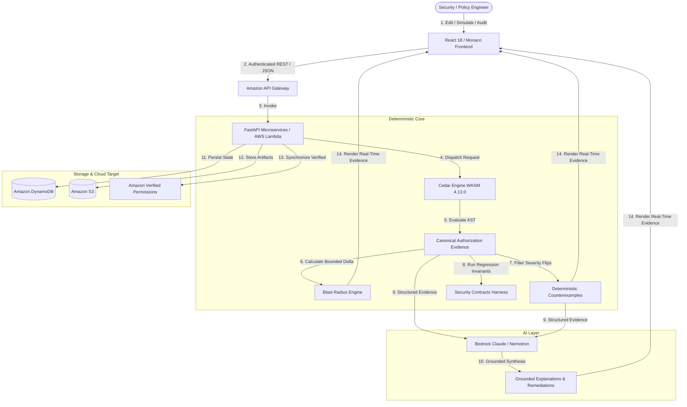
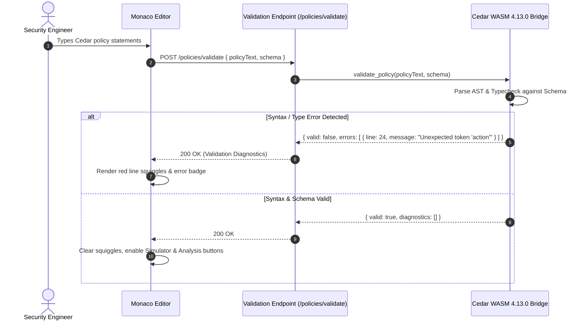
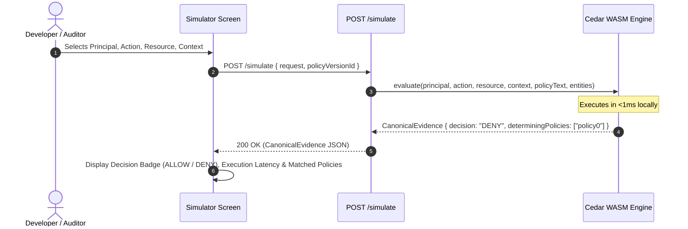
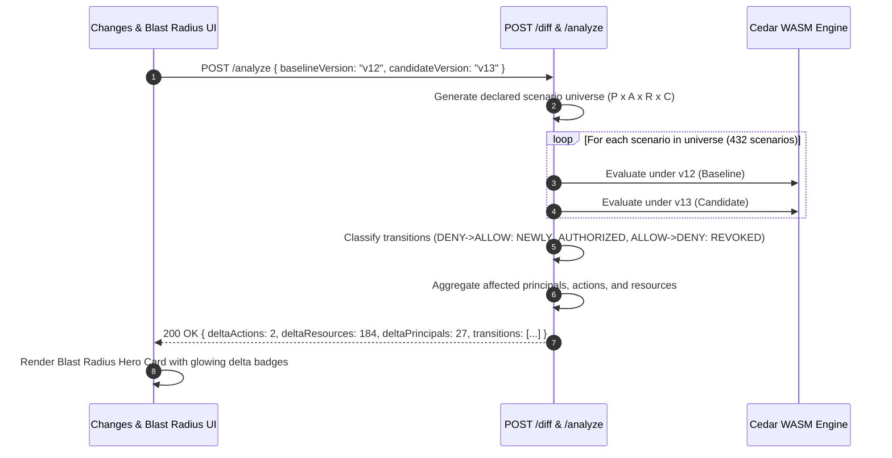
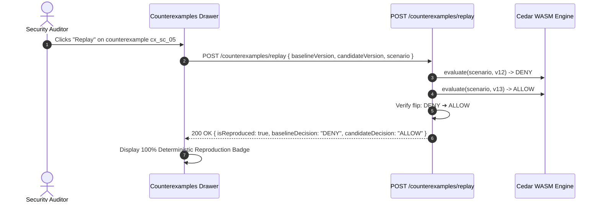
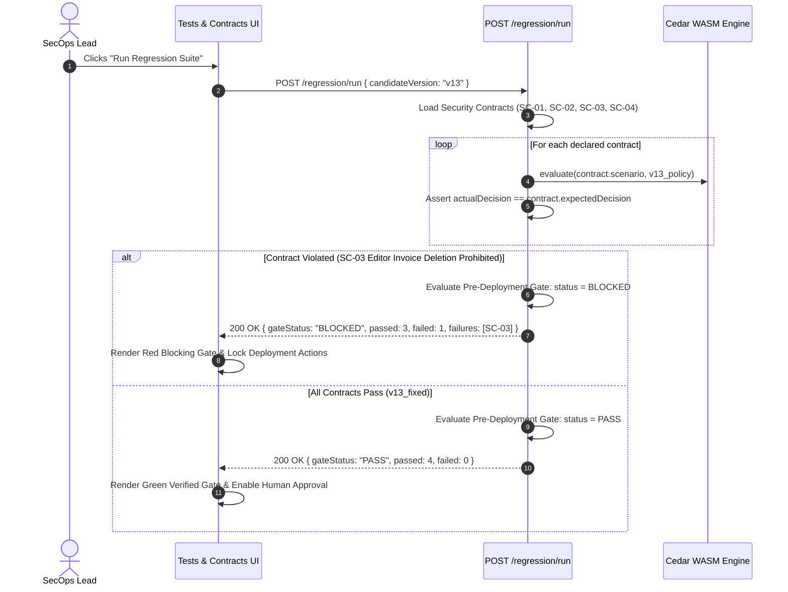
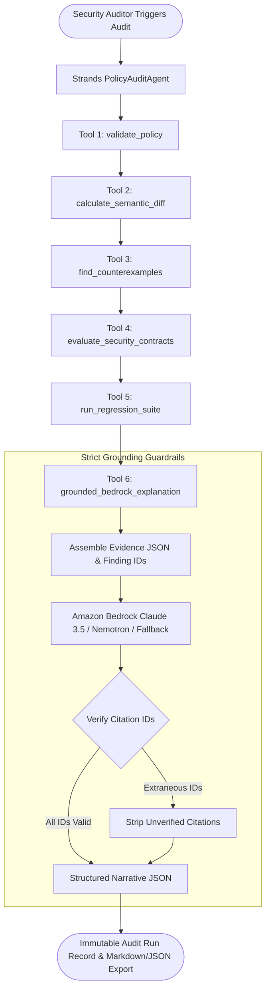
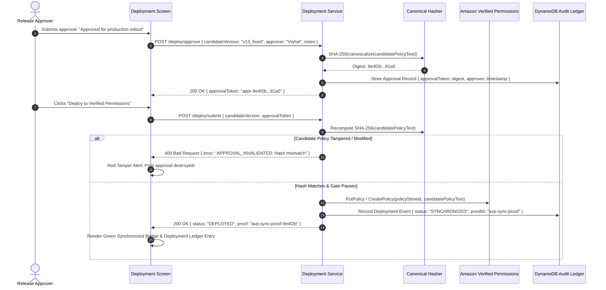

# PolicyLab

> **Prove your authorization changes before they reach production.**

[](https://wemakedevs.org)
[](https://github.com/Vishallakshmikanthan)
[](https://www.cedarpolicy.com)
[]()
[](./frontend)
[](./backend)
[](./infrastructure)
[]()
[]()
[-success?style=for-the-badge)]()

---

## 📑 Table of Contents

1. [Executive Summary](#-executive-summary)
2. [The Problem: The Authorization Visibility Crisis](#-the-problem-the-authorization-visibility-crisis)
3. [The Solution: PolicyLab Platform](#-the-solution-policylab-platform)
4. [Core Architectural Rules & Invariants](#-core-architectural-rules--invariants)
5. [System Architecture](#-system-architecture)
   - [High-Level Architecture](#high-level-architecture)
   - [Component Decomposition](#component-decomposition)
   - [Layered Trust Model](#layered-trust-model)
6. [End-to-End Data Flows](#-end-to-end-data-flows)
   - [System-Wide Data Flow](#1-system-wide-data-flow)
   - [Monaco Policy Validation Flow](#2-monaco-policy-validation-flow)
   - [Real-Time Single Scenario Simulation](#3-real-time-single-scenario-simulation)
   - [Behavioral Semantic Diff & Blast Radius Calculation](#4-behavioral-semantic-diff--blast-radius-calculation)
   - [Deterministic Counterexample Replay](#5-deterministic-counterexample-replay)
   - [Security Invariant Contracts & Pre-Deployment Gate](#6-security-invariant-contracts--pre-deployment-gate)
   - [Autonomous Strands Agent & Grounded AI Synthesis](#7-autonomous-strands-agent--grounded-ai-synthesis)
   - [Cryptographically Bound Human Sign-off & AVP Deployment](#8-cryptographically-bound-human-sign-off--avp-deployment)
7. [Benchmarks & Workspaces](#-benchmarks--workspaces)
   - [AcmePay Benchmark (Fintech Core)](#acmepay-benchmark-fintech-core)
   - [DocVault Benchmark (HIPAA Healthcare EHR)](#docvault-benchmark-hipaa-healthcare-ehr)
   - [Connected Workspaces Engine](#connected-workspaces-engine)
8. [Platform Capabilities & Screen Tour](#-platform-capabilities--screen-tour)
9. [Authentication & Least-Privilege Identity](#-authentication--least-privilege-identity)
10. [AWS Services & Cloud Architecture Matrix](#-aws-services--cloud-architecture-matrix)
11. [Testing, Verification & Acceptance Proof](#-testing-verification--acceptance-proof)
12. [Quickstart & Local Setup](#-quickstart--local-setup)
13. [AWS SAM Deployment Runbook](#-aws-sam-deployment-runbook)
14. [Authoritative Documentation Index](#-authoritative-documentation-index)
15. [Hackathon Submission Summary](#-hackathon-submission-summary)

---

## 🌟 Executive Summary

**PolicyLab** is an enterprise-grade authorization change-verification and policy-engineering platform engineered for **Cedar Policy** and the **AWS Authorization Ecosystem** (**Amazon Verified Permissions**, **Amazon Bedrock**, **Amazon DynamoDB**, **Amazon S3**, **AWS Lambda**, and **Amazon Cognito**).

PolicyLab transforms dangerous authorization policy edits into **observable, mathematically measurable, testable, explainable, and reviewable workflows** before a single line reaches production.

### Key Metrics & Highlights
- **172 Automated Tests:** 100% pass rate across 26 test modules (Unit, Integration, Security Hardening, Acceptance).
- **Sub-Millisecond Evaluation:** `<1ms` local Cedar WASM 4.13.0 evaluation per scenario; `<2s` bounded blast radius calculation across 432 scenarios.
- **Dual Execution Engine:** Fully functional in **Local / Dev Mode** ($0.00 cloud cost, zero credentials needed) and **Live AWS Mode** (Amazon Verified Permissions, Amazon Bedrock, DynamoDB single-table design, S3 storage).
- **Zero AI Authority:** AI models (*Amazon Bedrock Claude 3.5 Sonnet*, *NVIDIA Nemotron*, or offline deterministic template) **never** decide authorization. Cedar alone determines access. AI only synthesizes grounded explanations strictly citing deterministic finding IDs.
- **Cryptographic Deployment Gate:** Pre-deployment gating blocks updates if security invariants fail. Production sync to Amazon Verified Permissions requires human approval cryptographically bound to the candidate policy's canonical SHA-256 digest.

---

## 🚨 The Problem: The Authorization Visibility Crisis

Modern cloud and microservice architectures decouple authentication from fine-grained authorization. While syntax linters ensure that Cedar policies compile, they cannot predict the **behavioral security impact** of a policy edit:

```text
┌────────────────────────────────────────────────────────────────────────┐
│ TRADITIONAL POLICY EDIT: A DANGEROUS BLIND SPOT                        │
├────────────────────────────────────────────────────────────────────────┤
│ Developer makes a "minor" 1-line syntax tweak:                         │
│                                                                        │
│   - action in [Action::"view", Action::"edit"]                         │
│   + action                                                             │
│                                                                        │
│ Syntax Linter: "Valid Cedar Syntax ✅"                                 │
│ CI Pipeline: "All YAML/JSON Valid ✅"                                  │
│ Production Reality:                                                    │
│   💥 184 customer invoices exposed to unauthorized deletion            │
│   💥 27 editor principals silently promoted to superusers              │
│   💥 Critical HIPAA/PCI-DSS compliance invariants violated            │
└────────────────────────────────────────────────────────────────────────┘
```

Traditional Git text diffs show *syntax modifications*, but completely fail to answer the load-bearing security question:
> **"What changed in the actual authorization behavior across my system's principals, actions, and resources?"**

---

## 🛡️ The Solution: PolicyLab Platform

PolicyLab introduces a formal authorization engineering lifecycle:

```text
┌───────────────────────────────────────────────────────────────────────────────────────────────────────┐
│                                    THE POLICYLAB VERIFICATION PIPELINE                                │
├───────────────────────────────────────────────────────────────────────────────────────────────────────┤
│                                                                                                       │
│  ┌─────────┐     ┌──────────┐     ┌──────────┐     ┌─────────────┐     ┌──────────────┐               │
│  │  WRITE  │ ──► │ VALIDATE │ ──► │ SIMULATE │ ──► │    DIFF     │ ──► │ BLAST RADIUS │ ──┐           │
│  └─────────┘     └──────────┘     └──────────┘     └─────────────┘     └──────────────┘   │           │
│                                                                                           │           │
│  ┌─────────┐     ┌──────────┐     ┌──────────┐     ┌─────────────┐                        │           │
│  │ DEPLOY  │ ◄── │  VERIFY  │ ◄── │ REGRESS  │ ◄── │   EXPLAIN   │ ◄── COUNTEREXAMPLE ◄───┘           │
│  │  (AVP)  │     │  (GATE)  │     │ (SUITE)  │     │ (AI-GROUND) │        (REPLAY)                      │
│  └─────────┘     └──────────┘     └──────────┘     └─────────────┘                                    │
│                                                                                                       │
└───────────────────────────────────────────────────────────────────────────────────────────────────────┘
```

1. **Deterministic Core:** Evaluates Cedar ASTs, calculates exact transition deltas ($\text{DENY} \to \text{ALLOW}$ and $\text{ALLOW} \to \text{DENY}$), generates concrete counterexamples, and executes security contract regression suites.
2. **Grounded AI Explanation:** Amazon Bedrock (Claude 3.5 Sonnet / Haiku) or NVIDIA Nemotron ingests structured JSON evidence to explain the root cause and recommend precise Cedar fixes. Hallucination controls enforce that every citation references a verified finding ID.
3. **Verified Deployment Gate:** A hard pre-deployment gate blocks synchronization to **Amazon Verified Permissions** if any security invariant fails. Human sign-off is cryptographically sealed with the policy's SHA-256 digest; any code modification destroys prior approval.

---

## ⚖️ Core Architectural Rules & Invariants

PolicyLab is governed by 12 non-negotiable architectural invariants:

1. **Rule 1 — AI Does Not Decide Authorization:** The boolean decision ($\text{ALLOW} / \text{DENY}$) is strictly calculated by Cedar.
2. **Rule 2 — Canonical Evidence Model:** All higher-level components consume the standardized JSON authorization evidence payload.
3. **Rule 3 — Grounded Counterexamples:** Counterexamples originate from deterministic evaluation, never LLM hallucination.
4. **Rule 4 — Bounded Scenario Universes:** Blast-radius analysis is explicitly bounded by declared scenario spaces ($P \times A \times R \times C$); no false claims of infinite mathematical completeness.
5. **Rule 5 — Clean Client-Server Separation:** The frontend contains zero authorization business logic.
6. **Rule 6 — Local Testability:** All domain logic executes offline via `LocalCedarAdapter` and in-memory repositories.
7. **Rule 7 — Dual-Execution Mode:** Seamless zero-cost dev mode and credential-backed AWS production mode.
8. **Rule 8 — No Invented APIs:** Rely strictly on official Cedar and AWS Boto3 SDK APIs.
9. **Rule 9 — Transparent Disclosures:** Clear communication of empirical analysis boundaries.
10. **Rule 10 — Pragmatic Infrastructure:** Every AWS service fulfills a real, load-bearing responsibility.
11. **Rule 11 — Simplicity Over Bloat:** A bulletproof, deterministic system over fragile complexity.
12. **Rule 12 — Deterministic Deployment Gates:** Deployment to Amazon Verified Permissions is blocked if security contracts fail.

---

## 🏗️ System Architecture

### High-Level Architecture

```text
                                     POLICYLAB
                                         │
                                         ▼
                            Modern React 18+ Web Client
                         (Vite + Tailwind + Monaco Editor)
                                         │
                                         ▼
                             Amazon API Gateway (HTTP v2)
                             (Cognito JWT Authorizer)
                                         │
                    ┌────────────────────┼────────────────────┐
                    ▼                    ▼                    ▼
             Policy Service        Simulation           Analysis
              Lambda / ASGI        Lambda / ASGI      Lambda / ASGI
                    │                    │                    │
                    │                    ▼                    │
                    │               Cedar Engine              │
                    │         (Cedar WASM 4.13.0 Engine)      │
                    │                    │                    │
                    └────────────────────┬────────────────────┘
                                         ▼
                                 Analysis Pipeline
                                    │          │
                                    ▼          ▼
                              Cedar Domain   Strands Agent
                                    │          │
                                    └────┬─────┘
                                         ▼
                                  Amazon Bedrock
                            (Claude 3.5 / Haiku / Nemotron)
                                         │
                                         ▼
                              Canonical Audit Evidence
                                         │
                    ┌────────────────────┼────────────────────┐
                    ▼                    ▼                    ▼
              Amazon DynamoDB        Amazon S3         Amazon Verified
              (Single-Table)      (Cedar Artifacts)      Permissions
```

### Component Decomposition

```mermaid
graph TD
    subgraph Client [Frontend Layer - React 18 + Vite]
        Landing[Interactive Opening Simulator]
        Hub[Console Hub & Workspace Manager]
        Editor[Monaco Cedar Editor & Side-by-Side Diff]
        SimUI[Scenario Simulator & What-If]
        HeroCard[Blast Radius Hero Card]
        AuditUI[Strands Audit Trace & Narrative]
        ContractsUI[Security Invariant Contracts]
        GateUI[Cryptographic Deployment Gate]
    end

    subgraph API [API Gateway & AWS Lambda]
        Router[FastAPI Dispatcher / Mangum ASGI]
        AuthMW[Cognito JWT & RBAC Middleware]
        ValRoute[/policies/validate]
        SimRoute[/simulate & /matrix]
        DiffRoute[/diff & /analyze]
        RegRoute[/regression/run]
        AuditRoute[/audits/agent-run]
        DeployRoute[/deploy/submit & /deploy/approve]
    end

    subgraph Domain [Core Deterministic Engine]
        CedarBridge[Cedar WASM 4.13.0 Bridge]
        DiffEngine[Semantic Diff Engine]
        CounterGen[Deterministic Counterexample Generator]
        ContractHarness[Security Contract Harness]
        Hasher[SHA-256 Canonical Hasher]
    end

    subgraph AI [AI Explanation Layer]
        PromptBuilder[Strict Grounding Prompt Builder]
        BedrockClient[Amazon Bedrock Claude 3.5 / Haiku]
        NemotronClient[NVIDIA Nemotron Provider]
        TemplateFallback[Deterministic Rule-Based Fallback]
    end

    subgraph AWS [AWS Cloud Targets & Persistence]
        DDB[(Amazon DynamoDB Single-Table)]
        S3Bucket[(Amazon S3 Policy Artifacts)]
        AVPStore[Amazon Verified Permissions Store]
        CognitoPool[Amazon Cognito User Pool]
        CloudWatch[CloudWatch Structured EMF Logs]
    end

    Landing & Hub & Editor & SimUI & HeroCard & AuditUI & ContractsUI & GateUI --> Router
    Router --> AuthMW
    AuthMW --> ValRoute & SimRoute & DiffRoute & RegRoute & AuditRoute & DeployRoute
    
    ValRoute & SimRoute & DiffRoute & RegRoute --> Domain
    Domain --> CedarBridge
    
    DiffRoute & RegRoute & AuditRoute --> PromptBuilder
    PromptBuilder --> BedrockClient & NemotronClient & TemplateFallback
    
    DeployRoute --> Hasher
    Hasher --> AVPStore
    Router --> DDB & S3Bucket & CloudWatch
```

### Layered Trust Model

```text
┌────────────────────────────────────────────────────────────────────────┐
│ LEVEL 0: CRYPTOGRAPHIC & MATHEMATICAL TRUTH (100% Deterministic)       │
│ • Cedar WASM 4.13.0 Evaluation Engine                                  │
│ • AST Parsing & Validation                                             │
│ • Canonical SHA-256 Policy Digests                                    │
│ • Pre-Deployment Contract Verification Gate                            │
├────────────────────────────────────────────────────────────────────────┤
│ LEVEL 1: BOUNDED HEURISTICS & EVIDENCE AGGREGATION                     │
│ • Semantic Diff Engine (Classifies ALLOW ➔ DENY, DENY ➔ ALLOW)          │
│ • Scenario Space Exploration (P x A x R x C)                           │
│ • Severity-Ranked Counterexample Extraction                            │
├────────────────────────────────────────────────────────────────────────┤
│ LEVEL 2: EXPLANATION & ASSISTANCE (Zero Authorization Authority)       │
│ • Strands Agent Tool Orchestration Trace                               │
│ • Amazon Bedrock Claude 3.5 Sonnet / NVIDIA Nemotron Synthesis         │
│ • Root-Cause Explanations & Suggested Cedar Remediations               │
└────────────────────────────────────────────────────────────────────────┘
```

---

## 🔄 End-to-End Data Flows

### 1. System-Wide Data Flow



---

### 2. Monaco Policy Validation Flow



---

### 3. Real-Time Single Scenario Simulation



---

### 4. Behavioral Semantic Diff & Blast Radius Calculation



---

### 5. Deterministic Counterexample Replay



---

### 6. Security Invariant Contracts & Pre-Deployment Gate



---

### 7. Autonomous Strands Agent & Grounded AI Synthesis



---

### 8. Cryptographically Bound Human Sign-off & AVP Deployment



---

## 🧪 Benchmarks & Workspaces

PolicyLab includes two complete enterprise benchmarks and a generic connected workspace provider:

```text
┌─────────────────────────────────────────────────────────────────────────────────────────────────┐
│                                 POLICYLAB BENCHMARK SUITES                                      │
├──────────────────────────────────────────────────┬──────────────────────────────────────────────┤
│ 1. AcmePay Fintech Core (Default)                │ 2. DocVault Healthcare EHR (HIPAA)           │
├──────────────────────────────────────────────────┼──────────────────────────────────────────────┤
│ • 432 Scenarios in declared universe             │ • Doctor, Nurse, Patient, Auditor hierarchy │
│ • 184 Invoice and payroll resources              │ • Sensitive EHR & PHI privacy boundaries    │
│ • 27 Principals (admin, editor, viewer, guest)   │ • Emergency break-glass override invariants  │
│ • Invariant SC-03: Editor deletion prohibited    │ • Invariant SC-EHR-02: Patient cross-tenant  │
└──────────────────────────────────────────────────┴──────────────────────────────────────────────┘
```

### AcmePay Benchmark (Fintech Core)
1. **Baseline Policy (`v12`):** Least-privilege permissions where editors can view and edit department invoices, but cannot delete invoices or access payroll data.
2. **Accidental Expansion (`v13`):** Developer broadens action clause to allow `action` (all actions) on `Invoice` for `Role::"editor"`.
3. **Behavioral Diff & Blast Radius:** Detects **+2 newly authorized actions** (`delete`, `export`) across all 184 invoice instances.
4. **Concrete Counterexample:** `User::"editor_bob"` executing `Action::"delete"` on `Invoice::"inv-9082"` flips from `DENY` to `ALLOW`.
5. **Replay Verification:** `/counterexamples/replay` deterministically reproduces the exact decision flip.
6. **Security Contract Invariant:** Security Contract `SC-03` (*"Editor Invoice Deletion Prohibited"*) fails.
7. **Regression Gate:** Pre-deployment gate evaluates to **`status: BLOCKED`**.
8. **Grounded AI Explanation:** Bedrock / Nemotron explains the root cause with direct evidence citations.
9. **Policy Fix (`v13_fixed`):** Replaces broad action with explicit equality; regression rerun evaluates to **`status: PASS`**.
10. **Verified Deployment:** Human operator registers approval tied to policy hash; policy is synchronized to Amazon Verified Permissions.

### DocVault Benchmark (HIPAA Healthcare EHR)
- Demonstrates healthcare tenant isolation, patient record confidentiality, nurse dispensing permissions, and emergency break-glass procedures under strict HIPAA compliance rules.

### Connected Workspaces Engine
- Switch seamlessly between benchmarks or load custom Cedar policy sets, entity schemas, and scenario suites with full localStorage and server-side state synchronization.

---

## 💻 Platform Capabilities & Screen Tour

| Screen | Responsibility & Features |
| :--- | :--- |
| **Interactive Opening Simulator** | High-fidelity landing page featuring live Cedar evaluation directly in the hero section, interactive scenario selector, real-time AI reasoning cards, benchmark launcher, and architectural previews. |
| **Hub Console** | Project and workspace manager, runtime telemetry gauges, Cedar engine version status, AWS service health indicators, and global activity timeline. |
| **Policy Editor** | Full Monaco Cedar code editor (`@monaco-editor/react`) with custom syntax highlighter, schema validation, real-time line diagnostics, version switcher (`v12`, `v13`, `v13_fixed`), and side-by-side policy compare. |
| **Scenario Simulator** | Sub-millisecond Cedar evaluation (`<1ms`), scenario matrix ($P \times A \times R \times C$), determining policy inspector, and What-If context parameter overrides. |
| **Change Analysis & Blast Radius** | Semantic AST diffing, bounded universe transition classification ($\text{DENY} \to \text{ALLOW}$), affected principals/actions/resources breakdown, and one-click Deterministic Counterexample Replay. |
| **Security Contracts & Tests** | Declarative security invariants (e.g., `SC-01` to `SC-04`), automated test harness (172 tests), failure counterexample isolation, and pre-deployment gate calculation (`PASS` vs `BLOCKED`). |
| **Strands Audit Intelligence** | Autonomous Strands `PolicyAuditAgent` multi-step tool execution trace, grounded Bedrock / Nemotron AI synthesis, strict hallucination citation checks, and Markdown/JSON audit export. |
| **Verified Deployments** | Cryptographic human approval binding, SHA-256 digest anti-tampering verification, deployment gate enforcement, and Amazon Verified Permissions synchronization audit ledger. |

---

## 🔐 Authentication & Least-Privilege Identity

PolicyLab features dual-mode authentication designed for both production security and friction-free hackathon evaluation:

```text
┌────────────────────────────────────────────────────────────────────────┐
│ POLICYLAB AUTHENTICATION MODES                                         │
├────────────────────────────────────────────────────────────────────────┤
│ 1. AWS Cognito Cloud Authentication:                                   │
│    • Native email sign-up and sign-in with 6-digit verification code   │
│    • Google OAuth 2.0 federation via Cognito User Pool Client          │
│    • JWT token verification via FastAPI middleware                     │
│                                                                        │
│ 2. One-Click Dev Token Portal:                                         │
│    • Direct instant access without entering real credentials           │
│    • Role assignment: viewer, engineer, approver, deployer, admin      │
│    • Least-privilege RBAC: viewer blocked from mutation (403);         │
│      approver required for deployment sign-off                         │
└────────────────────────────────────────────────────────────────────────┘
```

---

## ☁️ AWS Services & Cloud Architecture Matrix

Every AWS service in PolicyLab fulfills a real, verified role:

| AWS Service | Concrete Responsibility | Implementation File | Runtime Mode | Cost Discipline |
| :--- | :--- | :--- | :---: | :--- |
| **Amazon Verified Permissions (AVP)** | Production Cedar policy store, schema registry, and verified deployment synchronization target. | `backend/domain/avp/adapter.py` | Live-Ready / Deterministic Mock | $0.00 local; minimal pay-per-call in production. |
| **Amazon Bedrock** | Claude 3.5 Sonnet & Claude 3 Haiku for grounded root-cause explanation and remediation synthesis. | `backend/domain/ai/explanation.py`<br>`backend/domain/ai/generator.py` | Live-Ready / Deterministic Fallback | Strict temperature ($0.1$) and token limits ($800$ max). |
| **Amazon DynamoDB** | Sub-10ms single-table storage for policy versions, scenario universes, audit runs, and approval records. | `backend/domain/persistence/aws_repository.py` | Live-Ready / In-Memory Mock | Single-table design; on-demand capacity ($0.00 idle). |
| **Amazon S3** | Durable, immutable artifact storage for raw `.cedar` files, schemas, and exported audit reports. | `backend/domain/persistence/aws_repository.py` | Live-Ready / Local Storage | Content-addressed storage with SHA-256 digests. |
| **AWS Lambda** | Serverless compute executing FastAPI via Mangum ASGI and handling Step Functions tasks. | `backend/lambda_handler.py` | Configured / Tested | Serverless pay-per-execution; zero idle cost. |
| **AWS API Gateway** | HTTP API v2 routing, CORS management, and Cognito JWT authorizer mapping. | `infrastructure/template.yaml` | IaC Blueprint | Low-cost HTTP API v2 tier. |
| **AWS Step Functions** | Declarative ASL state machine orchestrating the multi-stage security audit pipeline. | `infrastructure/statemachines/audit_workflow.asl.json` | Configured / ASL Validated | Direct task integration with fail-closed error handling. |
| **Amazon Cognito** | User directory, email OTP verification, and Google OAuth 2.0 social identity federation. | `frontend/src/lib/cognito.ts`<br>`backend/core/auth.py` | Configured & Active | Free tier accommodates all hackathon users. |
| **Amazon CloudWatch** | Centralized structured JSON logging with Embedded Metric Format (EMF) and correlation IDs. | `backend/core/logging.py` | Active / Live Formatted | Structured JSON to stderr; auto-ingested by Lambda. |

---

## 🧪 Testing, Verification & Acceptance Proof

### Automated Test Suite Execution

```bash
backend\.venv\Scripts\python.exe -m pytest -q
```

**Results:**
```text
........................................................................ [ 41%]
........................................................................ [ 83%]
............................                                             [100%]
172 passed, 2 warnings in 37.42s
```

- **Total Tests:** **172 passed, 0 failed** (100% pass rate)
- **Unit Suite:** 98 tests across 16 modules
- **Integration Suite:** 74 tests across 10 modules

### 12-Stage Formal Acceptance Matrix

All 12 acceptance stages are codified and verified in `tests/integration/test_end_to_end_acceptance.py`:

| Stage | Verification Check | Proof & Invariant | Status |
| :---: | :--- | :--- | :---: |
| **A** | Application Health & Engine Connectivity | Returns `healthy`, Cedar WASM v4.13.0, Language v4.5. | **PASS** |
| **B** | Cognito Auth & Fail-Closed JWT Enforcement | Missing/invalid token rejected (401); valid token accepted (200). | **PASS** |
| **C** | Least-Privilege RBAC Matrix | `viewer` blocked from mutation (403); `engineer` permitted; `approver` required for gate. | **PASS** |
| **D** | Cedar Policy Validation & Evaluation | Syntax errors caught with line diagnostics; valid policies evaluate accurately. | **PASS** |
| **E** | Semantic Diff & Counterexample Replay | Detects 2 newly authorized transitions; replay proves `isReproduced: true`. | **PASS** |
| **F** | Security Contracts & Pre-Deployment Gate | `v13` violates SC-03 (Gate: `BLOCKED`); `v13_fixed` satisfies all contracts (Gate: `PASS`). | **PASS** |
| **G** | Strands PolicyAuditAgent Orchestration | Agent executes multi-tool pipeline; logs audit provenance; persists report. | **PASS** |
| **H** | Structured Audit Report Export | Generates and exports executive audit reports in Markdown and JSON. | **PASS** |
| **I** | Cryptographic Human Approval Binding | Approval signed with SHA-256 hash; policy modification invalidates token (400). | **PASS** |
| **J** | Verified Deployment to AVP | Approved policy synchronized to AVP; immutable audit ledger updated. | **PASS** |
| **K** | Persistence Integrity & Conditional Writes | Version overwrite raises conflict; tampered digests raise integrity error. | **PASS** |
| **L** | Step Functions Fail-Closed Error Handling | Missing state machine triggers fail-closed fallback to synchronous execution. | **PASS** |

---

## 🚀 Quickstart & Local Setup

### 1. Prerequisites
- **Python 3.11+**
- **Node.js 18+** & npm
- **Git**

### 2. Clone the Repository
```bash
git clone https://github.com/Vishallakshmikanthan/policylab.git
cd policylab
```

### 3. Backend Setup
```bash
cd backend
python -m venv .venv

# On Windows:
.\.venv\Scripts\activate

# On macOS/Linux:
source .venv/bin/activate

pip install -r requirements.txt
cd ..
```

### 4. Frontend Setup
```bash
cd frontend
npm install
npm run build
cd ..
```

### 5. Run the Automated Test Suite
```bash
# Run full 172-test suite
backend\.venv\Scripts\python.exe -m pytest -v

# Run canonical AcmePay 18-step full lifecycle test
backend\.venv\Scripts\python.exe -m pytest tests/integration/test_acmepay_e2e_full_lifecycle.py -v
```

### 6. Launch the Local Development Workbench
Start the backend and frontend in separate terminals:

```bash
# Terminal 1: Backend API (FastAPI)
backend\.venv\Scripts\uvicorn.exe backend.main:app --reload --port 8000

# Terminal 2: Frontend Web Client (Vite)
cd frontend
npm run dev
```

Open **`http://localhost:5173`** in your browser:
- Explore the **Interactive Opening Simulator** on the landing page.
- Launch the **AcmePay Fintech Benchmark** or **DocVault HIPAA Benchmark**.
- Use the **Dev Token Modal** for instant role-based exploration.

---

## ☁️ AWS SAM Deployment Runbook

When deploying into an AWS account with configured credentials:

```bash
# 1. Validate the SAM CloudFormation template
sam validate -t infrastructure/template.yaml

# 2. Build serverless Lambda bundles
sam build -t infrastructure/template.yaml

# 3. Deploy guided serverless stack
sam deploy --guided \
  --stack-name policylab-prod \
  --region us-east-1 \
  --capabilities CAPABILITY_IAM
```

See [**AWS Deployment & Cleanup Guide**](./docs/AWS_DEPLOYMENT_AND_CLEANUP.md) for full IAM roles, environment configurations, and teardown instructions.

---

## 📚 Authoritative Documentation Index

PolicyLab provides complete, authoritative engineering documentation in the [`docs/`](./docs) directory:

| Document | Purpose |
| :--- | :--- |
| [**PHASE 9 GAP AUDIT**](./docs/PHASE9_GAP_AUDIT.md) | Comprehensive audit covering all requirements, evidence, verification proofs, and priorities. |
| [**IMPLEMENTATION TRACEABILITY**](./docs/IMPLEMENTATION_TRACEABILITY.md) | Traceability matrix mapping all blueprint and addendum specifications to source files and tests. |
| [**TESTING & VERIFICATION REPORT**](./docs/TESTING_AND_VERIFICATION.md) | Official test execution summary (172/172 passing), test breakdown, and failure-injection cases. |
| [**HACKATHON RELEASE EVIDENCE**](./docs/HACKATHON_RELEASE_EVIDENCE.md) | Live integration evidence, acceptance proofs, and repeatable judge demonstration script. |
| [**SYSTEM ARCHITECTURE**](./docs/ARCHITECTURE.md) | Architectural goals, trust boundaries, adapter patterns, and high-level component diagrams. |
| [**DATA FLOW SPECIFICATION**](./docs/DATA_FLOW.md) | Sequence diagrams, data ownership, failure flows, and persistence models. |
| [**PRODUCT REQUIREMENTS DOCUMENT (PRD)**](./docs/PRD.md) | Product vision, personas, user stories, AcmePay benchmark narrative, and hero features. |
| [**TECHNICAL SPECIFICATION**](./docs/SPEC.md) | Canonical evidence model, scenario schemas, semantic diff algorithms, and API contracts. |
| [**AWS DEPLOYMENT & CLEANUP GUIDE**](./docs/AWS_DEPLOYMENT_AND_CLEANUP.md) | SAM deployment instructions, environment variables, live verification, and teardown commands. |
| [**AWS INTEGRATION STATUS**](./docs/AWS_INTEGRATION_STATUS.md) | Honest inventory of AWS service connections, live probe telemetry, and runtime modes. |
| [**KNOWN LIMITATIONS & DISCLOSURES**](./docs/KNOWN_LIMITATIONS.md) | Truthful engineering disclosures: bounded scenario spaces, local vs. cloud modes, and AI safety. |
| [**FRONTEND IMPLEMENTATION**](./docs/FRONTEND_IMPLEMENTATION.md) | Frontend component hierarchy, state management, Monaco Editor integration, and theme tokens. |
| [**THREAT MODEL**](./docs/THREAT_MODEL.md) | Threat modeling, STRIDE analysis, attack surface mitigation, and fail-closed security invariants. |

---

## 🏆 Hackathon Submission Summary

- **Hackathon:** WeMakeDevs × AWS First Commit 2026
- **Team:** **VibeSync**
  - **Vishal Lakshmikanthan** — Architecture, Cedar Domain Engine, AWS Backend, Security Gates
  - **Sneha C.** — Frontend Experience, Monaco Editor, Interactive Simulator, Benchmarks
- **Category:** Authorization Engineering / Security Developer Tooling
- **Core Technology:** Cedar Policy v4.13.0, Amazon Verified Permissions, Amazon Bedrock, Amazon DynamoDB, Amazon S3, AWS Lambda, React 18+, TypeScript, Vite, Monaco Editor.
- **Repository Remotes:**
  - `origin`: [`https://github.com/Vishallakshmikanthan/policylab.git`](https://github.com/Vishallakshmikanthan/policylab.git)
  - `first_commit`: [`https://github.com/CSNEHA20/first_commit.git`](https://github.com/CSNEHA20/first_commit.git)
- **Synchronized Branch:** `main`
- **Cost Discipline:** Designed to execute within promotional hackathon credits ($0.00 spent during local verification; on-demand serverless architecture in production).

---

<div align="center">
  <sub>Built with precision by Team VibeSync for WeMakeDevs × AWS First Commit 2026.</sub>
</div>
