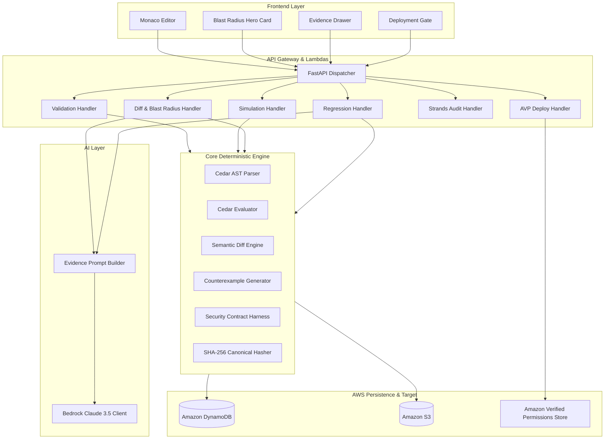

# PolicyLab — System Architecture

**Document Type:** Authoritative System Architecture & Engineering Blueprint  
**Version:** 1.0.0  
**Authors:** Vishal & Sneha (VibeSync)  
**Hackathon:** WeMakeDevs × AWS First Commit 2026  

---

## 1. Architecture Goals

PolicyLab is engineered to solve the **authorization semantic visibility problem**. Its architectural goals are:
1. **Absolute Determinism:** Ensure every authorization evaluation, diff, and counterexample is $100\%$ reproducible.
2. **Strict AI Containment:** Enforce a hard architectural boundary where AI explains facts but **never** decides access.
3. **Sub-Second Responsiveness:** Maintain sub-100ms simulation and $<2\text{s}$ blast radius calculation through local Cedar engine execution.
4. **Cloud-Native AWS Integration:** Seamlessly target Amazon Verified Permissions, Amazon Bedrock, and AWS serverless infrastructure.
5. **Offline Testability:** Pluggable adapter architecture enabling the complete core engine to execute locally without cloud dependencies.

---

## 2. Architecture Principles

1. **Rule 1 — AI Does Not Decide Authorization:** The boolean decision ($\text{ALLOW} / \text{DENY}$) is strictly calculated by Cedar.
2. **Rule 2 — Grounded Counterexamples:** Counterexamples originate from deterministic evaluation, never LLM hallucination.
3. **Rule 3 — Bounded Scenario Universes:** Blast-radius analysis is explicitly bounded by declared scenario spaces and entity schemas; no false claims of infinite mathematical completeness.
4. **Rule 4 — Clean Client-Server Separation:** The frontend contains zero authorization business logic.
5. **Rule 5 — Adapter Pattern for Cloud Services:** Domain logic interacts with AWS via clean interfaces (`ICedarEngine`, `IAVPAdapter`, `IBedrockClient`).
6. **Rule 6 — Local Testability:** Core engine runnable offline via `LocalCedarAdapter`.
7. **Rule 7 — No Fake Security Results:** No synthetic alerts without underlying scenario evidence.
8. **Rule 8 — No Invented APIs:** Rely on standard Cedar and AWS SDK APIs.
9. **Rule 9 — Transparent Boundaries:** Clear communication of empirical analysis limits.
10. **Rule 10 — Pragmatic Infrastructure:** Only use AWS services that perform real, load-bearing work.
11. **Rule 11 — Simplicity Over Bloat:** A bulletproof 6-feature system beats a fragile 15-feature platform.
12. **Rule 12 — Deterministic Deployment Gates:** Deployment to Amazon Verified Permissions is blocked if security contracts fail.

---

## 3. High-Level Architecture

```text
                                POLICYLAB
                                    │
                                    ▼
                             React Frontend
                        (Tailwind + Monaco Editor)
                                    │
                                    ▼
                               API Gateway
                                    │
               ┌────────────────────┼────────────────────┐
               ▼                    ▼                    ▼
         Policy Service       Simulation           Analysis
            Lambda              Lambda               Lambda
               │                    │                    │
               │                    ▼                    │
               │              Cedar Engine               │
               │        (Local / Native Engine)          │
               │                    │                    │
               └────────────────────┬────────────────────┘
                                    ▼
                            Analysis Pipeline
                               │          │
                               ▼          ▼
                         Cedar/Domain   Strands Agent
                               │          │
                               └────┬─────┘
                                    ▼
                             Amazon Bedrock
                          (Claude 3.5 Sonnet)
                                    │
                                    ▼
                             Audit Evidence
                                    │
               ┌────────────────────┼────────────────────┐
               ▼                    ▼                    ▼
         Amazon DynamoDB        Amazon S3         Amazon Verified
         (State & Keys)      (Cedar Artifacts)      Permissions
```

---

## 4. Component Architecture



---

## 5. Frontend Architecture

- **SPA Architecture:** React 18+ Single Page Application bundled with Vite.
- **Monaco Engine:** Customized Cedar tokenization, line numbers, error squiggles, and AST hover tooltips.
- **Server Cache:** TanStack Query managing asynchronous data synchronization.
- **Strict Boundary:** The frontend never decides access; it strictly renders structured JSON responses from the backend.

---

## 6. API Architecture

RESTful JSON APIs built with FastAPI:
- `POST /policies` — Create immutable policy version.
- `POST /policies/{id}/validate` — Real-time Cedar syntax and schema verification.
- `POST /simulate` — Ad-hoc scenario evaluation.
- `POST /diff` — Textual and structural AST diff.
- `POST /analyze` — Bounded blast radius computation and counterexample ranking.
- `POST /regression/run` — Security contract regression suite execution.
- `POST /explain` — Grounded Bedrock narrative generation.
- `POST /deploy` — Gated synchronization to Amazon Verified Permissions.

---

## 7. Domain Architecture

The domain layer is pure Python with zero cloud dependencies:
- `PolicySet`, `PolicyVersion`, `Scenario`, `SecurityContract`, `AnalysisRun`.
- Algorithms for matrix evaluation, delta extraction, and canonical SHA-256 hashing.

---

## 8. Cedar Architecture

```text
┌──────────────────────────────────────────────────────────────┐
│ DOMAIN LAYER                                                 │
│                                                              │
│                   ┌───────────────────────┐                  │
│                   │     ICedarEngine      │                  │
│                   └───────────▲───────────┘                  │
│                               │                              │
│               ┌───────────────┴───────────────┐              │
│               │                               │              │
│   ┌───────────────────────┐       ┌───────────────────────┐  │
│   │   LocalCedarAdapter   │       │ AVPProductionAdapter  │  │
│   │ (Python bindings/WASM)│       │  (Boto3 / AVP SDK)    │  │
│   └───────────────────────┘       └───────────────────────┘  │
└──────────────────────────────────────────────────────────────┘
```

- **LocalCedarAdapter:** High-speed in-process Cedar evaluation for sub-100ms simulations and 1,000+ scenario matrix evaluations.
- **AVPProductionAdapter:** Calls Amazon Verified Permissions `IsAuthorized` for production policy store deployment and live testing.

---

## 9. Analysis Architecture

### Blast Radius & Counterexample Pipeline
1. **Universe Enumeration:** $\mathcal{U} = \mathcal{P} \times \mathcal{A} \times \mathcal{R} \times \mathcal{C}$.
2. **Dual-Version Evaluation:** Evaluate all $u \in \mathcal{U}$ against $v_{\text{baseline}}$ and $v_{\text{candidate}}$.
3. **Transition Classification:** Group into $\text{DENY}\to\text{ALLOW}$, $\text{ALLOW}\to\text{DENY}$, and unchanged.
4. **Severity Scoring:** Weight destructive actions on sensitive resources.
5. **Contract Cross-Check:** Flag transitions that violate declared security contracts.

---

## 10. AI Architecture

- **Amazon Bedrock (Claude 3.5 Sonnet / Claude 3 Haiku):**
  - Prompt contains only structured JSON facts from Cedar execution.
  - Generates: (1) Root cause summary, (2) Security risk narrative, (3) Suggested Cedar remediation.
  - AI responses are visually and structurally segregated from deterministic facts.

---

## 11. Strands Architecture

The `PolicyAuditAgent` uses the Strands Agents SDK to orchestrate verification:
1. `validate_policy()` $\to$ 2. `calculate_semantic_diff()` $\to$ 3. `find_counterexamples()` $\to$ 4. `run_regression_suite()` $\to$ 5. `summarize_findings()`.
- **Governance Constraint:** The agent cannot deploy policies autonomously.

---

## 12. AWS Architecture

- **Amazon API Gateway:** Front door for client requests, CORS handling, rate limiting.
- **AWS Lambda:** Serverless microservices running Python 3.11+.
- **Amazon DynamoDB:** Sub-10ms state persistence for metadata, versions, scenarios, and audit records.
- **Amazon S3:** Durable object storage for raw `.cedar` files and audit artifacts.
- **Amazon Bedrock:** Serverless foundation model API.
- **Amazon Verified Permissions:** Target policy store for verified policy deployments.
- **AWS Amplify:** Global CDN hosting for the React frontend.
- **Amazon CloudWatch:** Structured JSON telemetry and operational logging.

---

## 13. Persistence Architecture

Single-table DynamoDB design (`PolicyLab_Entities`) with overloaded partition/sort keys (`PROJECT#{id}`, `VERSION#{v}`, `CONTRACT#{c}`) paired with immutable S3 object storage for raw policy files.

---

## 14. Deployment Architecture

Infrastructure as Code defined via AWS SAM (`template.yaml`), enabling complete one-command deployment (`sam build && sam deploy`) to AWS accounts.

---

## 15. Security Architecture

- **Least Privilege IAM:** Lambda execution roles restricted to specific DynamoDB tables, S3 paths, and AVP policy stores.
- **Zero Client Credentials:** Browser never receives AWS access keys.
- **SHA-256 Integrity:** All policy versions are cryptographically hashed and verified before deployment.

---

## 16. Trust Boundaries

```text
[ Browser / Client ] (UNTRUSTED)
         │  TLS / HTTPS + JWT
         ▼
[ API Gateway ] (TRUST BOUNDARY)
         │  AWS IAM Role
         ▼
[ Lambda Microservices ] (INTERNAL TRUSTED)
         ├──► [ Cedar Engine ] (DETERMINISTIC)
         ├──► [ Amazon DynamoDB / S3 ] (ENCRYPTED AT REST)
         ├──► [ Amazon Bedrock ] (CONTROLLED JSON FACT PAYLOAD)
         └──► [ Amazon Verified Permissions ] (PROTECTED PRODUCTION STORE)
```

---

## 17. Threat Considerations

- **Policy Injection:** Sanitization of Cedar policy text before evaluation.
- **LLM Hallucination:** Strict prompt grounding on structured JSON evidence.
- **Unauthorized Deployment:** Blocking deployment gate when security invariants fail.

---

## 18. Failure Handling

- **Evaluation Timeouts:** Bounded scenario universes prevent combinatorial explosion.
- **Bedrock Outage:** Graceful fallback to raw Cedar evidence with AI explanation disabled.
- **Deployment Failures:** Atomic transactions ensuring rollback on AVP sync errors.

---

## 19. Observability

- Structured CloudWatch JSON logs with `requestId`, `versionId`, `scenarioCount`, and `executionDurationMs`.
- Performance metrics tracking simulation latency and blast radius compute times.

---

## 20. Testing Architecture

- **Unit Tests:** Cedar parsing, diff classification, hashing, and counterexample ranking.
- **Integration Tests:** End-to-end API flows with local mock adapters.
- **Regression Invariants:** 100% test coverage over the AcmePay canonical demo suite.

---

## 21. Local Development Architecture

Complete local developer loop:
```bash
# Backend
cd backend && uvicorn main:app --reload

# Frontend
cd frontend && pnpm dev
```
Runs fully offline using in-memory state and local Cedar bindings.

---

## 22. Production Architecture

Fully serverless, multi-AZ deployment on AWS with API Gateway, Lambda, DynamoDB on-demand, S3, Bedrock, and Amazon Verified Permissions.

---

## 23. Adapter Strategy

```python
class ICedarEngine(ABC):
    @abstractmethod
    def evaluate(self, request, policy_text, entities): pass

class LocalCedarAdapter(ICedarEngine):
    """Local Python Cedar bindings for rapid in-memory evaluation."""
    pass

class AWSVerifiedPermissionsAdapter(ICedarEngine):
    """AWS AVP IsAuthorized client for live production verification."""
    pass
```

---

## 24. Repository Structure

```text
policylab/
│
├── frontend/
│   ├── src/
│   │   ├── components/
│   │   ├── features/
│   │   │   ├── editor/
│   │   │   ├── simulator/
│   │   │   ├── diff/
│   │   │   ├── blast-radius/
│   │   │   ├── audit/
│   │   │   └── deployment/
│   │   ├── lib/
│   │   └── state/
│   ├── package.json
│   └── vite.config.ts
│
├── backend/
│   ├── functions/
│   │   ├── policy_service.py
│   │   ├── simulation_service.py
│   │   ├── diff_service.py
│   │   ├── analysis_service.py
│   │   ├── explanation_service.py
│   │   ├── regression_service.py
│   │   └── deployment_service.py
│   │
│   ├── domain/
│   │   ├── models/
│   │   ├── cedar/
│   │   ├── analysis/
│   │   ├── contracts/
│   │   └── hashing/
│   │
│   └── agents/
│       └── policy_audit_agent/
│
├── infrastructure/
│   ├── template.yaml
│   ├── parameters/
│   └── policies/
│
├── fixtures/
│   ├── demo-policy-v12/
│   ├── demo-policy-v13/
│   ├── entities/
│   └── scenarios/
│
├── tests/
│   ├── unit/
│   ├── integration/
│   └── security/
│
├── docs/
│   ├── PRD.md
│   ├── SPEC.md
│   ├── TECH_STACK.md
│   ├── FRONTEND_IMPLEMENTATION.md
│   ├── DATA_FLOW.md
│   └── ARCHITECTURE.md
│
└── README.md
```

---

## 25. Architecture Evolution

- **Phase 1 (Hackathon MVP):** Bounded scenario analysis, local Cedar engine, serverless AWS Lambdas, Bedrock explanation, Verified Permissions deployment gate.
- **Phase 2 (Post-Hackathon):** CI/CD GitHub Action integration, live CloudWatch traffic scenario mining, unbounded symbolic SMT analysis.

---

## 26. Four-Day Implementation Phases

```text
FOUNDATION (Schemas, Adapters, Types)
    ↓
CEDAR ENGINE (Local Parsing & Evaluation)
    ↓
POLICY VERSIONS (Immutable Records & SHA-256 Hashing)
    ↓
SEMANTIC DIFF (Decision Transition Matrix)
    ↓
BLAST RADIUS (Bounded Universe Matrix & Deltas)
    ↓
COUNTEREXAMPLES (Deterministic Finding Extraction & Ranking)
    ↓
SECURITY CONTRACTS (Invariant Definition & Scenario Mapping)
    ↓
REGRESSION TESTING (Automated Suite Execution & Reporting)
    ↓
BEDROCK EXPLANATION (Structured Grounding & Remediation)
    ↓
STRANDS AUDIT AGENT (Multi-Tool Orchestration)
    ↓
AWS PERSISTENCE (DynamoDB & S3 Integration)
    ↓
VERIFIED PERMISSIONS (Target Policy Store Deployment Gate)
    ↓
POLISHED FRONTEND (Monaco, Hero Card, Evidence Drawer)
    ↓
END-TO-END DEMO (AcmePay Live Demonstration & Video)
```
