# PolicyLab — Data Flow & Interaction Models

**Version:** 1.0.0  
**Status:** Approved Specification  
**Hackathon:** WeMakeDevs × AWS First Commit 2026  

---

## 1. System Data Flow

PolicyLab enforces a unidirectional, deterministic data flow:

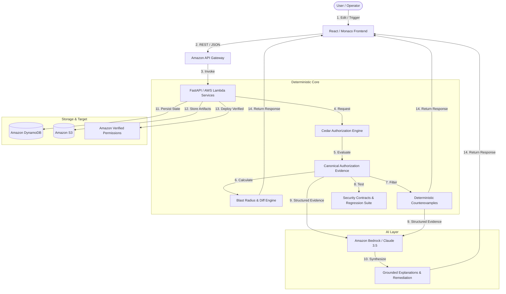

---

## 2. User-to-System Flow

1. **User Action:** The user updates a Cedar policy in Monaco Editor or triggers a version comparison.
2. **API Dispatch:** The client issues typed HTTP requests with JWT/API tokens to API Gateway.
3. **Lambda Execution:** Targeted microservices execute deterministic algorithms.
4. **Result Presentation:** Visual updates render in the UI in $<100\text{ms}$ for simulations and $<2\text{s}$ for blast radius diffs.

---

## 3. Policy Creation Flow

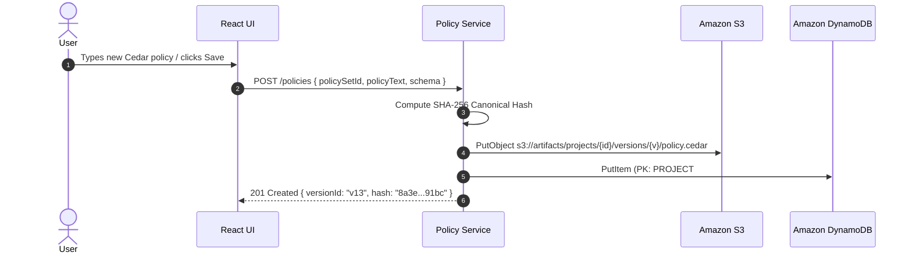

---

## 4. Policy Validation Flow

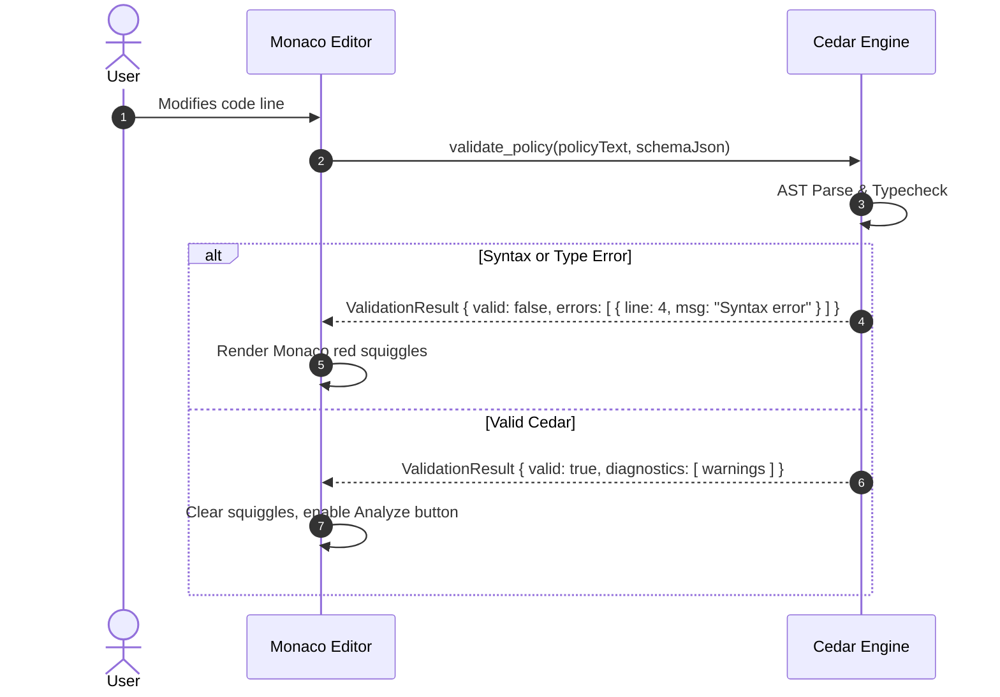

---

## 5. Simulation Flow

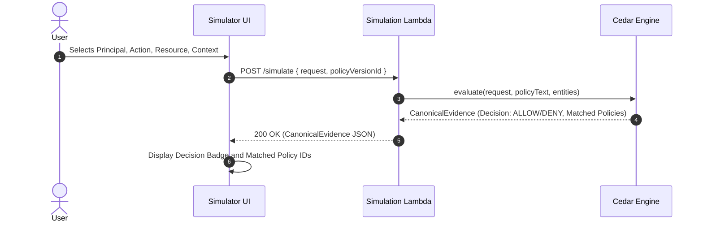

---

## 6. Versioning Flow

- Every saved modification creates a new immutable version record.
- The parent version ID is permanently linked.
- The canonical SHA-256 hash is computed over normalized policy text to guarantee audit integrity.

---

## 7. Diff Flow

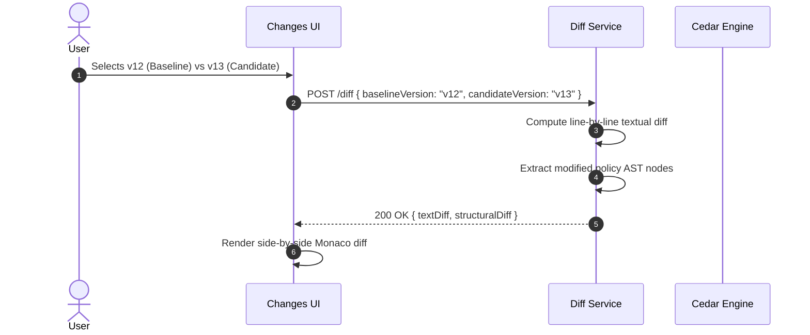

---

## 8. Blast Radius Flow

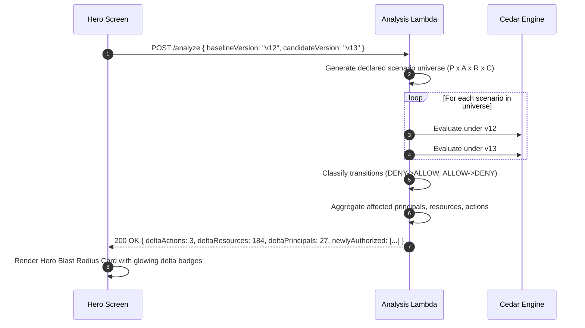

---

## 9. Counterexample Flow

1. Filter the blast radius results for $\text{DENY} \to \text{ALLOW}$ transitions.
2. Apply the deterministic severity ranking heuristic.
3. Cross-reference against declared Security Contracts.
4. Return top-ranked counterexamples with complete request context.

---

## 10. Security Contract Flow

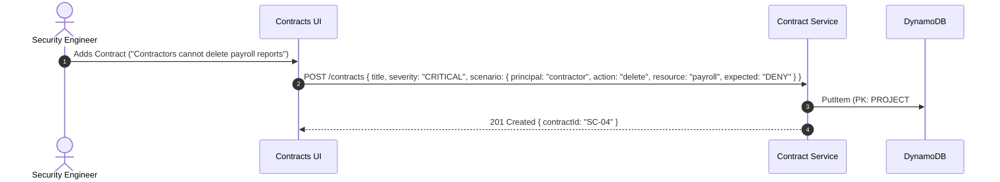

---

## 11. Regression Flow

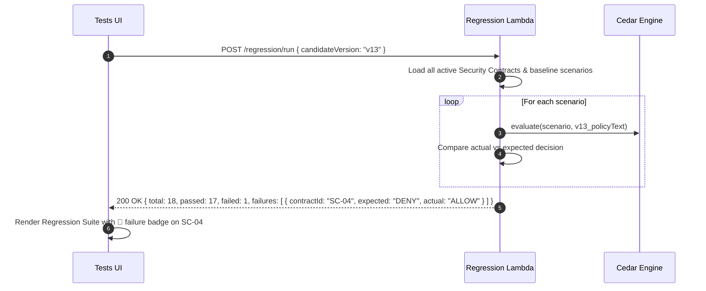

---

## 12. Bedrock Explanation Flow

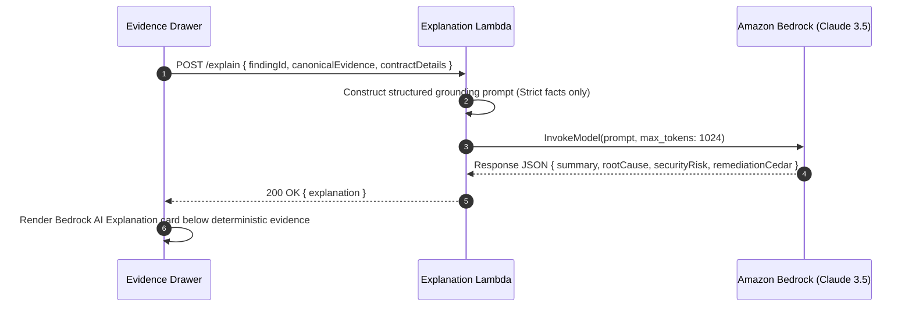

---

## 13. Strands Agent Flow

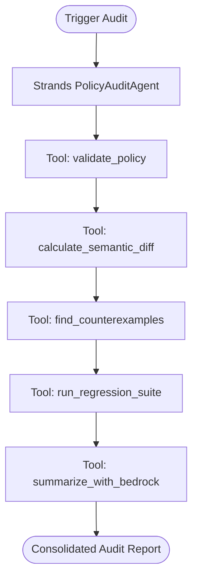

---

## 14. Audit Flow

1. End-to-end execution of validation, diffing, counterexample generation, regression tests, and Bedrock synthesis.
2. Generates an immutable `AuditRun` record stored in DynamoDB and S3.
3. Sets overall gate status: `VERIFIED` or `BLOCKED`.

---

## 15. Deployment Flow

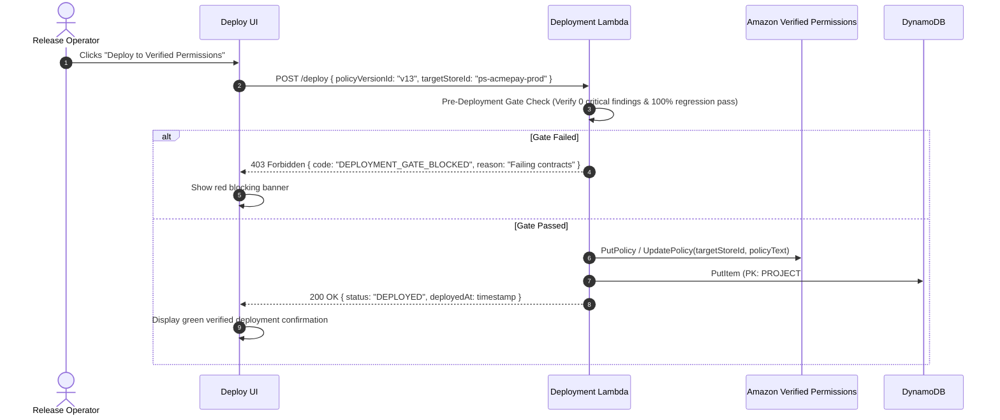

---

## 16. Failure Flows

- **Cedar Syntax Failure:** Block compilation immediately; display line squiggles.
- **Contract Regression:** Hard-block deployment gate; mark audit run as `BLOCKED`.
- **Bedrock API Timeout:** Return deterministic Cedar evidence with a fallback note (*"AI explanation temporarily unavailable; deterministic evidence intact"*).

---

## 17. Data Ownership

- **User / Organization:** Owns all policy files, schemas, scenario fixtures, and contract definitions.
- **PolicyLab System:** Manages computed hashes, diff matrices, and audit execution metadata.

---

## 18. Data Persistence

### Amazon DynamoDB Schema

```text
Table: PolicyLab_Entities
PK                      | SK                     | Attributes
------------------------------------------------------------------------------------------------------------------------
PROJECT#ps_acmepay      | METADATA               | { name: "AcmePay Core", activeVersion: "v12", owner: "Vishal" }
PROJECT#ps_acmepay      | VERSION#v12            | { version: 12, hash: "4f1a...89a1", s3Key: "...", status: "DEPLOYED" }
PROJECT#ps_acmepay      | VERSION#v13            | { version: 13, hash: "8a3e...91bc", s3Key: "...", status: "BLOCKED" }
PROJECT#ps_acmepay      | CONTRACT#sc_04         | { title: "Contractors cannot delete payroll", severity: "CRITICAL" }
PROJECT#ps_acmepay      | AUDIT#audit_991        | { baseline: "v12", candidate: "v13", regressions: 1, status: "BLOCKED" }
PROJECT#ps_acmepay      | DEPLOYMENT#dep_01      | { version: "v12", storeId: "ps-acmepay-prod", deployedAt: "..." }
```

### Amazon S3 Object Hierarchy

```text
s3://policylab-artifacts-prod/
├── projects/
│   └── ps_acmepay/
│       ├── schema.json
│       ├── entities.json
│       └── versions/
│           ├── v12/policy.cedar
│           └── v13/policy.cedar
└── audits/
    └── audit_991/
        ├── evidence.json
        └── report.md
```

---

## 19. Sensitive Data Boundaries

- PolicyLab evaluates authorization using tokenized principal and resource identifiers (e.g., `User::"alice"`), never requiring real PII or live database credentials.

---

## 20. AI Data Boundary

- Amazon Bedrock is sent **only** structured JSON facts.
- Prompts explicitly forbid the model from making authorization decisions or evaluating access rules.

---

## 21. Deterministic Evidence Boundary

- Every piece of data surfaced to the UI originates from Cedar execution logs and mathematical set operations before reaching the user or Bedrock.

---

## 22. End-to-End Data Flow

From policy edit in Monaco to verified production sync in Amazon Verified Permissions, all state transitions are immutable, cryptographically verifiable, and strictly gated by deterministic evidence.

---

## 23. Enforced 9-Stage Evaluation Pipeline Data Flow (Stage D)

PolicyLab enforces a strict sequential pipeline before Cedar evaluation:

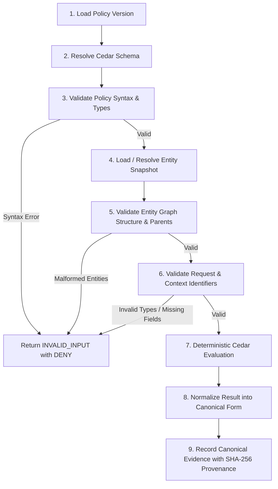

---

## 24. Enterprise Database Adapter Extension Architecture (Stage B)

PolicyLab decouples authorization evaluation from concrete database engines via the `IEntityProvider` contract. Additional enterprise adapters can be plugged in without modifying the Cedar engine or diff pipeline:

```text
┌────────────────────────────────────────────────────────┐
│               PolicyLab Cedar Engine                   │
└───────────────────────────┬────────────────────────────┘
                            │ Consumes Cedar JSON Entities
┌───────────────────────────▼────────────────────────────┐
│                    IEntityProvider                     │
│  (get_entity, load_entities, load_snapshot, etc.)      │
└───────┬─────────────┬─────────────┬─────────────┬──────┘
        │             │             │             │
┌───────▼──────┐┌─────▼──────┐┌─────▼──────┐┌─────▼──────┐
│  Fixture     ││ DynamoDB   ││ PostgreSQL ││  LDAP / AD │
│  Provider    ││ Provider   ││ Provider   ││  Provider  │
└──────────────┘└────────────┘└────────────┘└────────────┘
```

### Implementing Future Enterprise Adapters:

1. **PostgreSQL Adapter (`PostgreSQLEntityProvider`):**
   - Query: `SELECT entity_type, entity_id, attributes, parent_uids FROM authorization_entities WHERE entity_uid = ANY(%s);`
   - Mapping: Converts relational columns into Cedar JSON (`{"uid": {"type": row.entity_type, "id": row.entity_id}, "attrs": row.attributes, "parents": row.parent_uids}`).
   - Connection pooling via `asyncpg` or SQLAlchemy.

2. **Redis Adapter (`RedisEntityProvider`):**
   - Query: `MGET entity:User:alice entity:Role:admin`
   - Mapping: Parses cached JSON string records into Cedar entity objects.
   - Ideal for ultra-low latency request-scoped entity lookups ($<2\text{ms}$).

3. **LDAP / Active Directory Adapter (`LDAPEntityProvider`):**
   - Query: LDAP search filter `(&(objectClass=user)(sAMAccountName=alice))` with memberOf attribute mapping.
   - Mapping: Maps user CN and group memberships into `Role` and `Group` parent entities.

---

## 25. AWS Step Functions Asynchronous Audit Orchestration (Stage I2)

For multi-stage verification workflows on larger scenario suites, PolicyLab orchestrates through an asynchronous Step Functions state machine (`infrastructure/statemachines/audit_workflow.asl.json`):

```text
ValidateCandidatePolicy
  │
  ├── [Syntax Error] ──► AuditHaltedSyntaxError (Fail)
  │
  └── [Valid]
        │
        ▼
ExecuteSemanticDiffAndRegression
        │
        ├── [PASS] ──► GenerateGroundedExplanation ──► StoreAuditReport ──► Complete
        │
        └── [BLOCKED] ─► GenerateViolationExplanation ─► StoreAuditReport ─► Complete
```

---

## 26. Phase 8 Verified Deployment & Observability Data Flow

```text
Operator / UI                PolicyLab Backend               Verified Permissions           CloudWatch Logs
     │                               │                                 │                            │
     │── 1. Prepare Deployment ─────►│                                 │                            │
     │   (candidateText, targetEnv)  │── Compute Candidate SHA-256     │                            │
     │                               │── Check Gate == PASS?           │                            │
     │                               │── (If BLOCKED: Blocked, Stop)   │                            │
     │                               │                                 │── Log Metric ─────────────►│
     │◄── Return Prepared Record ────│                                 │   DeploymentPrepared /     │
     │    (prepId, policyHash, OK)   │                                 │   DeploymentBlocked (EMF)  │
     │                               │                                 │                            │
     │── 2. Register Human Sign-Off ─►                                 │                            │
     │   (prepId, policyHash, approv)│── Verify Policy Hash Match      │                            │
     │                               │── Verify Gate is PASS           │                            │
     │                               │── Store Approval Token          │── Log Metric ─────────────►│
     │◄── Return Approval Token ─────│                                 │   HumanApprovalGranted     │
     │                               │                                 │                            │
     │── 3. Submit Deployment ──────►│                                 │                            │
     │   (token, candidateText)      │── Verify Token Exists           │                            │
     │                               │── Verify Policy Hash Matches    │                            │
     │                               │   Token Digest (Anti-Tamper)    │                            │
     │                               │── Invoke create_policy() ──────►│                            │
     │                               │◄── Return policyId / proof ─────│                            │
     │                               │── Record in Audit Ledger        │── Log Metric ─────────────►│
     │◄── Return Synchronized ───────│                                 │   DeploymentSubmitted (EMF)│
```


