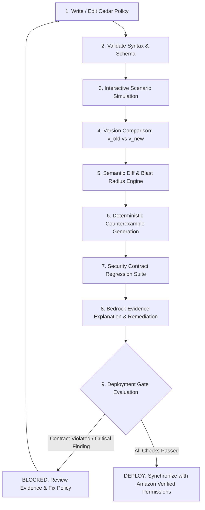

# PolicyLab — Product Requirements Document

**Tagline:** *Prove your authorization changes before they reach production.*  
**Hackathon:** WeMakeDevs × AWS First Commit 2026  
**Team:** VibeSync — Vishal & Sneha  
**Category:** Authorization Engineering / Security Developer Tooling  

---

## 1. Executive Summary

Modern cloud-native applications decouple authentication from fine-grained authorization using declarative policy engines such as AWS Cedar and Amazon Verified Permissions. While syntax validation ensures that a policy parses and compiles, it provides zero insight into the **behavioral and semantic security consequences** of a policy edit. A single-line change—such as modifying an action scope or weakening a resource constraint—can silently expand permissions across hundreds of resources and dozens of principal roles, causing catastrophic data exposure or privilege escalation.

**PolicyLab** is an authorization change-verification and policy-engineering workflow platform. It transforms authorization policy changes into measurable, traceable, testable, explainable, and reviewable workflows before changes reach production. 

PolicyLab operates on a foundational rule:
> **Deterministic security evidence first. AI explanation second. AI never decides authorization.**

---

## 2. Product Vision

PolicyLab bridges the critical gap between authoring an authorization policy and safely deploying it. Our vision is to make authorization changes as rigorous, observable, and testable as software builds:

```text
WRITE ──► VALIDATE ──► SIMULATE ──► DIFF ──► ANALYZE ──► COUNTEREXAMPLES ──► EXPLAIN ──► REGRESSION TESTS ──► VERIFY ──► DEPLOY
```

Developers and security engineers should never deploy an authorization policy without knowing:
1. **Who gained or lost access?** (Population & Action Delta)
2. **What concrete authorization requests behave differently?** (Deterministic Counterexamples)
3. **Did any organizational security invariant break?** (Security Contract Violations)
4. **Why did the engine make this change?** (Grounded AI Explanation of Evidence)
5. **Is the change safe to deploy to Amazon Verified Permissions?** (Automated Deployment Gate)

---

## 3. Problem Statement

Authentication answers *"Who are you?"*, while authorization answers *"What are you allowed to do?"*.

In modern systems, authorization rules depend on:
- Principal attributes and hierarchical roles (e.g., admin, editor, contractor, support).
- Resource hierarchy and classification (e.g., Invoices, Payroll Reports, Customer Records).
- Contextual environment (e.g., IP address, MFA status, time of day, tenant ID).
- Relationships (e.g., resource ownership, team membership).

When policies evolve, security teams face three compounding problems:
1. **Semantic Invisibility:** Text diffs (e.g., git diffs) show changed syntax (e.g., `- action == Action::"view"` to `+ action`), but fail to show the operational blast radius across principals and resources.
2. **Silent Permission Drift:** Permissions expand unintentionally over time without triggering compiler or linter errors.
3. **Lack of Regression Testing:** Authorization rules lack executable test harnesses; teams rely on manual spot checks or discover regressions during live production breaches.

---

## 4. Why This Problem Matters

- **Over-Privilege & Data Leaks:** Broken Object Level Authorization (BOLA) and Broken Function Level Authorization (BFLA) remain top OWASP API security risks.
- **High Blast Radius:** A minor condition relaxation in a top-level policy can grant destructive actions (`delete`, `export`) to external contractors across all tenant boundaries.
- **Slow Deployment Velocity:** Security reviews for authorization policies are manual, fear-driven, and bottleneck release cycles because reviewers lack deterministic behavioral proofs.

---

## 5. Target Users

1. **Backend & Cloud Engineers:** Developers implementing Cedar policies and integrating Amazon Verified Permissions into microservices and APIs.
2. **Security & Compliance Engineers:** SecOps and AppSec professionals tasked with reviewing IAM/Cedar policies, establishing security baselines, and auditing permission drift.
3. **Platform & DevOps Leads:** Engineers managing CI/CD deployment pipelines, authorization gates, and cloud infrastructure governance.

---

## 6. User Personas

### Persona A: Alex (Cloud Application Developer)
- **Role:** Full-stack engineer writing features for a multi-tenant fintech app.
- **Pain Point:** Modifies a Cedar policy to let editors manage customer drafts, but fears accidentally granting them access to payroll data or audit logs.
- **Goal:** Wants instant simulation feedback, textual and behavioral diffs, and verification that existing capabilities remain intact before committing changes.

### Persona B: Priya (Application Security Engineer)
- **Role:** Security reviewer responsible for approving production authorization updates.
- **Pain Point:** Reviewing raw Cedar policies in PRs is tedious and error-prone; git diffs do not show effective permission surfaces.
- **Goal:** Wants concrete counterexamples, automated security contract evaluation, and grounded explanations to approve or block pull requests rapidly.

### Persona C: Marcus (DevOps / Release Manager)
- **Role:** Pipeline owner overseeing production deployments to AWS.
- **Pain Point:** Lack of pre-deployment validation gates for Amazon Verified Permissions.
- **Goal:** Wants an automated, blocking deployment gate that ensures all regression tests pass and no critical contract violations exist before deploying.

---

## 7. Core User Problem

The central product question that PolicyLab answers is:
> **"What changed in the authorization behavior of my system?"**

PolicyLab replaces guesswork with deterministic behavioral proofs and clear visual explanations.

---

## 8. Product Solution

PolicyLab provides a multi-layer verification platform:

1. **Deterministic Core Engine:** Evaluates Cedar policies, compares policy versions, computes bounded authorization blast radii, discovers deterministic counterexamples, and executes security contract regression suites.
2. **AI Reasoning & Explanation Layer (Amazon Bedrock & Strands Agents):** Ingests structured deterministic evidence to generate natural language explanations, risk summaries, and candidate policy remediations. **AI never evaluates or decides authorization.**
3. **Human-Centric Review & Deployment Gate:** Interactive visualization of newly authorized actions, affected populations, evidence drawers, and a hard gate preventing deployment to **Amazon Verified Permissions** when security contracts fail.

---

## 9. Product Principles

1. **Deterministic Security First:** Cedar and deterministic logic are the sole arbiters of authorization truth.
2. **AI Explains, Never Authorizes:** AI synthesizes, explains, and suggests based strictly on verified evidence; it cannot approve changes or evaluate access.
3. **No Phantom Findings:** Every security alert, counterexample, and regression failure is backed by a concrete authorization scenario.
4. **Bounded Analysis Transparency:** Blast radius analysis is explicitly bounded by declared scenario universes and entity schemas; no false claims of infinite mathematical completeness.
5. **Fail-Closed Governance:** If a security contract fails or a critical counterexample is detected, the deployment gate blocks production synchronization by default.
6. **Frictionless Developer Experience:** Sub-second simulation feedback, ergonomic Monaco-based editing, and structured evidence drawers.

---

## 10. Core Workflow



---

## 11. Core Product Concepts

### Policy Set
A named collection of Cedar policies governing an application domain (e.g., `AcmePay-Core-Authz`), containing schemas, entity definitions, scenarios, version history, and regression suites.

### Policy Version
An immutable snapshot of a Policy Set tagged with a sequential version number (e.g., `v12`), parent version reference, author, timestamp, and a canonical SHA-256 integrity hash computed over the normalized policy text.

### Authorization Scenario
A deterministic unit test composed of:
$$\text{Scenario} = (\text{Principal}, \text{Action}, \text{Resource}, \text{Context}) \longrightarrow \text{Expected Decision } (\text{ALLOW } | \text{ DENY})$$

### Permission Surface
The effective multi-dimensional matrix of authorization decisions produced by evaluating all valid combinations of Principals, Actions, Resources, and Contexts against a Policy Set.

### Counterexample
A concrete authorization request demonstrating an unintended or high-risk decision transition (specifically $\text{DENY} \rightarrow \text{ALLOW}$) between two policy versions.

### Security Contract
A formalized, persistent organizational invariant (e.g., *"Contractors cannot delete payroll reports"* or *"Cross-tenant resource access is forbidden"*) that translates into one or more executable regression scenarios.

### Audit Run
A comprehensive evaluation execution orchestrated across validation, semantic diffing, blast radius calculation, counterexample extraction, regression execution, and Bedrock narrative synthesis.

### Deployment
The verified, cryptographically signed synchronization of a validated Policy Set version into **Amazon Verified Permissions** policy stores.

---

## 12. Core Features

### P0 Features (Must Have for Hackathon Demo)

| # | Feature | Description |
|---|---|---|
| **P0.1** | **Cedar Policy Editor** | Monaco-based editor with Cedar syntax highlighting, schema diagnostics, formatting, and live error markers. |
| **P0.2** | **Cedar Validation Engine** | Real-time schema-aware Cedar syntax and type validation. |
| **P0.3** | **Scenario Simulator** | Ad-hoc scenario evaluation (`Principal`, `Action`, `Resource`, `Context`) returning decision, diagnostics, and matched policy IDs. |
| **P0.4** | **Policy Versioning & SHA-256 Hashing** | Immutable policy version creation with parent links and deterministic SHA-256 artifact hashing. |
| **P0.5** | **Textual & Structural Policy Diff** | Side-by-side visual diff highlighting added, modified, or removed Cedar statements and clauses. |
| **P0.6** | **Semantic / Behavioral Diff** | Matrix delta categorizing decisions into: $\text{DENY}\to\text{ALLOW}$, $\text{ALLOW}\to\text{DENY}$, $\text{ALLOW}\to\text{ALLOW}$, and $\text{DENY}\to\text{DENY}$. |
| **P0.7** | **Authorization Blast Radius (Hero Feature)** | Quantitative and categorical summary of impacted actions, principals, and resource populations. |
| **P0.8** | **Deterministic Counterexample Generator** | Extraction of concrete, high-risk requests that flip decisions unexpectedly. |
| **P0.9** | **Security Contract Harness** | System for defining security invariants that map directly to enforceable test scenarios. |
| **P0.10** | **Regression Testing Suite** | Automated test suite execution across all baseline security contracts with pass/fail metrics. |
| **P0.11** | **Bedrock Evidence Explanation** | Amazon Bedrock integration synthesizing structured evidence into root-cause explanations and suggested fixes. |
| **P0.12** | **Strands Audit Agent** | Strands SDK agent orchestrating the multi-step audit pipeline via deterministic tool calling. |
| **P0.13** | **Verified Permissions Deployment Gate** | Pre-deployment verification gate deploying only green, verified policies to Amazon Verified Permissions. |

### P1 Features (Should Have / Post-P0)

1. **Access Matrix View:** Interactive grid showing Principal Roles vs. Action/Resource pairs with color-coded permission states and evidence drill-down.
2. **What-If Simulator:** Natural-language query interface allowing developers to simulate hypothetical policy adjustments.
3. **Policy Generator:** Draft Cedar policy generation via Bedrock from natural language requirements (marked as untrusted drafts until validated).
4. **Version Timeline & Visual History:** Graphical tree/timeline showing policy evolution, authors, test outcomes, and deployment tags.
5. **Exportable Audit Report:** Structured Markdown/JSON audit report exportable for compliance and security audit trails.

### Deferred Features (Explicitly Out of Hackathon Scope)
- Real-time multi-user Google Docs-style concurrent editing and inline commenting.
- Enterprise SSO / Complex RBAC beyond demo requirements.
- Multi-cloud authorization synchronization (e.g., Google Cloud IAM / Azure RBAC).
- Dynamic runtime sidecar proxying or live production packet inspection.
- Custom proprietary authorization languages (PolicyLab is strictly Cedar-native).

---

## 13. Hero Feature: Authorization Blast Radius

The core visual and technical centerpiece of PolicyLab is the **Authorization Blast Radius** analysis:

```text
┌───────────────────────────────────────────────────────────────────────┐
│ ONE-LINE POLICY EDIT                                                  │
│ - action == Action::"view"                                            │
│ + action                                                              │
└──────────────────────────────────┬────────────────────────────────────┘
                                   │
                                   ▼
┌───────────────────────────────────────────────────────────────────────┐
│ ⚠ AUTHORIZATION BLAST RADIUS                                         │
│ +3 Actions  |  +184 Resources  |  +27 Principals                      │
│                                                                       │
│ Newly Authorized Operations:                                          │
│ • Contractor  ──► DELETE ──► Invoice                                  │
│ • Contractor  ──► EXPORT ──► PayrollReport                            │
│ • Editor      ──► DELETE ──► Invoice                                  │
└──────────────────────────────────┬────────────────────────────────────┘
                                   │
                                   ▼
┌───────────────────────────────────────────────────────────────────────┐
│ CONCRETE COUNTEREXAMPLE                                               │
│ Principal: Contractor::"alice"                                        │
│ Action:    Action::"delete"                                           │
│ Resource:  PayrollReport::"2026-Q1"                                   │
│ Baseline:  DENY                                                       │
│ Proposed:  ALLOW  (⚠ Unintended Expansion)                           │
└──────────────────────────────────┬────────────────────────────────────┘
                                   │
                                   ▼
┌───────────────────────────────────────────────────────────────────────┐
│ SECURITY CONTRACT VIOLATION                                           │
│ Invariant: "Contractors cannot delete payroll reports."               │
│ Result:    🔴 REGRESSION FAILURE                                      │
└──────────────────────────────────┬────────────────────────────────────┘
                                   │
                                   ▼
┌───────────────────────────────────────────────────────────────────────┐
│ DEPLOYMENT GATE: ⛔ BLOCKED                                            │
└───────────────────────────────────────────────────────────────────────┘
```

---

## 14. Canonical Demo Story: AcmePay

### Context
**AcmePay** is a fintech application managing multi-tenant customer transactions, invoices, and payrolls.

- **Roles:** `admin`, `finance-manager`, `editor`, `support`, `contractor`, `viewer`.
- **Resources:** `Invoice`, `PayrollReport`, `CustomerRecord`, `SupportTicket`.
- **Actions:** `view`, `edit`, `delete`, `export`.

### Baseline Policy (v12)
Editors can view and edit invoices in their department, but cannot delete invoices or access payroll reports. Contractors have strictly read-only access to assigned support tickets.

```cedar
// Baseline: Permissive read for editors
permit (
    principal in Role::"editor",
    action == Action::"view",
    resource in ResourceType::"Invoice"
);
```

### The Accidental Change (v13)
A developer intends to allow editors to view and edit invoices, but writes a broad action clause:

```cedar
// Proposed v13: Accidental broadening
permit (
    principal in Role::"editor",
    action, // BROADENED: Applies to ALL actions (view, edit, delete, export)
    resource in ResourceType::"Invoice"
);
```

### Detection Workflow
1. **Validation:** Passes syntax check ($100\%$ valid Cedar).
2. **Behavioral Diff:** Identifies that `Role::"editor"` gained `Action::"delete"` and `Action::"export"` on all `Invoice` resources.
3. **Blast Radius Calculation:** Computes $+2$ actions across $184$ invoice instances for $27$ editor principals.
4. **Counterexample Discovered:** `User::"editor_bob"` executing `Action::"delete"` on `Invoice::"inv-9082"` transitions from `DENY` $\rightarrow$ `ALLOW`.
5. **Contract Check:** Security Contract `SC-04` (*"Editors cannot delete invoices"*) fails.
6. **Bedrock Explanation:** Explains that omitting the specific equality predicate on `action` expanded permissions to destructive operations.
7. **Gate Action:** Deployment to Amazon Verified Permissions is **BLOCKED**.

---

## 15. User Stories

1. **US-01 (Pre-Save Validation):** As a developer, I want real-time Cedar syntax and schema validation in the editor so that I can catch structural syntax errors immediately.
2. **US-02 (Interactive Simulation):** As a developer, I want to simulate an ad-hoc request against my draft policy so that I can inspect matched policies and the authorization decision.
3. **US-03 (Semantic & Textual Diff):** As a developer, I want to compare two policy versions to see both code changes and effective authorization behavior changes.
4. **US-04 (Blast Radius Discovery):** As a security engineer, I want to view the quantitative blast radius (+actions, +principals, +resources) of a policy update to understand overall impact.
5. **US-05 (Concrete Counterexamples):** As a security reviewer, I want deterministic counterexamples showing specific unauthorized requests that flipped from `DENY` to `ALLOW`.
6. **US-06 (Security Contracts):** As a security architect, I want to define executable security invariants that run automatically as regression tests on every policy change.
7. **US-07 (Grounded AI Explanation):** As a reviewer, I want Amazon Bedrock to explain deterministic findings and suggest remediations without hallucinations.
8. **US-08 (Orchestrated Audit):** As a SecOps lead, I want the Strands agent to run an end-to-end audit workflow and produce a comprehensive audit score and summary.
9. **US-09 (Safe Deployment Gate):** As a release engineer, I want the deployment pipeline to block synchronization to Amazon Verified Permissions if any security contract fails.

---

## 16. Functional Requirements

- **FR-01 (Editor):** Monaco-based code editor supporting Cedar language grammar, line numbering, folding, and error squiggles.
- **FR-02 (Validation):** Must return line-accurate diagnostics (errors/warnings) for syntax and schema mismatches.
- **FR-03 (Simulation):** Must execute Cedar authorization requests with arbitrary Principal, Action, Resource, Context, and Entity graphs.
- **FR-04 (Version Control):** Must persist immutable versions with semantic metadata, author attribution, and SHA-256 hashes.
- **FR-05 (Diff Engine):** Must compute textual diffs and evaluate behavioral transitions over the declared scenario matrix.
- **FR-06 (Blast Radius):** Must calculate total count and exact lists of newly authorized and newly forbidden tuples.
- **FR-07 (Counterexamples):** Must extract and rank counterexamples by severity (destructive actions on sensitive resources prioritized).
- **FR-08 (Regression Engine):** Must run a suite of security scenarios against candidate policies and return granular pass/fail outputs.
- **FR-09 (AI Explanation):** Must format deterministic evidence payloads, invoke Amazon Bedrock (Claude 3.5 Sonnet / Haiku), and output structured explanations.
- **FR-10 (Strands Agent):** Must execute multi-tool audit pipelines with deterministic tool calls.
- **FR-11 (AVP Deployment):** Must interface with Amazon Verified Permissions to push verified Cedar policy sets into target Policy Stores.

---

## 17. Non-Functional Requirements

- **Correctness & Determinism:** Cedar evaluation, diffing, and regression runs must be $100\%$ reproducible and deterministic.
- **Explainability:** All AI-generated text must directly reference concrete deterministic evidence fields (`principal`, `action`, `resource`, `matchedPolicy`).
- **Performance:**
  - In-browser / local scenario simulation: $<100\text{ ms}$.
  - Semantic diff and blast radius calculation (bounded universe): $<2\text{ s}$.
  - AI explanation generation: $<10\text{ s}$.
  - Full audit suite run: $<25\text{ s}$.
- **Security & Integrity:** Policy versions must be cryptographically hashed (SHA-256). All AWS API calls must adhere to least-privilege IAM roles.
- **Reliability & Testability:** The core engine must be completely testable locally without requiring active AWS connections (via adapter patterns).

---

## 18. Security Requirements

1. **Credential Safety:** The browser frontend must never store or expose raw AWS secret keys or long-term IAM credentials.
2. **Policy Isolation:** Multi-tenant workspace data must be strictly isolated at the storage and database layer.
3. **Artifact Integrity:** S3 policy artifacts and DynamoDB metadata records must match their computed SHA-256 hash.
4. **Input Sanitization:** All policy code, schemas, and scenario fixtures must be sanitized against injection and excessive payload limits.

---

## 19. AI Safety Requirements

1. **No Autonomous Decision Making:** Bedrock and Strands must NEVER compute the authorization decision. The boolean decision ($\text{ALLOW} / \text{DENY}$) is strictly calculated by Cedar.
2. **Grounded Prompts:** AI prompts must ingest structured JSON evidence exclusively.
3. **Clear Boundary Attribution:** The UI must visually segregate deterministic findings (green/red badges, scenario tables) from AI suggestions (purple/indigo AI cards).
4. **Untrusted Code Tagging:** Candidate Cedar policies generated by AI must be explicitly flagged as `UNTRUSTED DRAFT` until validated and tested.

---

## 20. AWS Requirements

1. **Amazon Verified Permissions:** Primary production target for policy store management and live Cedar evaluation.
2. **Amazon Bedrock:** Foundational model provider (Anthropic Claude 3.5 Sonnet / Claude 3 Haiku) for evidence explanation.
3. **AWS Lambda:** Serverless execution runtime for Python/FastAPI microservices.
4. **Amazon DynamoDB:** Single-digit millisecond latency persistence for PolicySets, Versions, Scenarios, Contracts, and Audit runs.
5. **Amazon S3:** Durable object storage for raw `.cedar` files, schema definitions, and audit artifacts.
6. **AWS Step Functions:** State machine orchestration for long-running comprehensive audit pipelines.
7. **AWS Amplify / CloudFront:** High-performance global frontend hosting.

---

## 21. Success Criteria

1. **Hackathon Demo Execution:** Flawless 3-minute live demonstration of the AcmePay hero scenario (v12 $\to$ v13 $\to$ blast radius $\to$ counterexample $\to$ contract violation $\to$ Bedrock explanation $\to$ fix $\to$ verified AVP deployment).
2. **Verification Integrity:** $100\%$ pass rate on unit and integration test suites covering Cedar parsing, blast radius categorization, and regression execution.
3. **User Experience WOW Factor:** Dark-mode security tool aesthetic with sub-second feedback, rich visual diffs, and crystal-clear evidence drawers.

---

## 22. Hackathon Constraints

- **Window:** 4-day sprint for development, hardening, and video production.
- **Team Size:** 2 engineers (Vishal & Sneha) working with clean separation of concerns.
- **AWS Free Tier / Credit Discipline:** Optimized Lambda footprints, DynamoDB on-demand billing, and minimal Bedrock token overhead.
- **Reliability Over Scope:** A bulletproof 6-feature demo beats an unstable 15-feature prototype.

---

## 23. Product Boundaries (What PolicyLab Does NOT Claim)

1. **Not a Replacement for Cedar:** PolicyLab builds directly on top of Cedar; it does not replace the language or runtime.
2. **Not Mathematically Exhaustive SMT Verification:** Blast radius analysis evaluates a bounded, declared scenario space; it is not an unbounded formal SMT solver like Dafny.
3. **Not Autonomous AI Security:** PolicyLab does not claim "AI secures your cloud." AI is an explanatory copilot grounded in deterministic facts.
4. **Not Every Permit/Forbid is a Conflict:** Cedar's default deny and explicit permit/forbid semantics are normal; PolicyLab flags regressions against defined contracts, not standard Cedar mechanics.

---

## 24. Future Direction

- **Automated SMT Boundary Exploration:** Integration with Cedar formal analysis tools for unbounded symbolic verification.
- **CI/CD GitHub Action:** Automated pull-request bot commenting with blast-radius badges and blocking PR merges on contract failures.
- **Live CloudWatch Ingestion:** Ingesting live Amazon Verified Permissions query logs to automatically synthesize realistic test scenarios from production traffic patterns.
- **IDE Extensions:** VS Code / Cursor extension providing real-time inline blast-radius previews as developers type Cedar policies.
