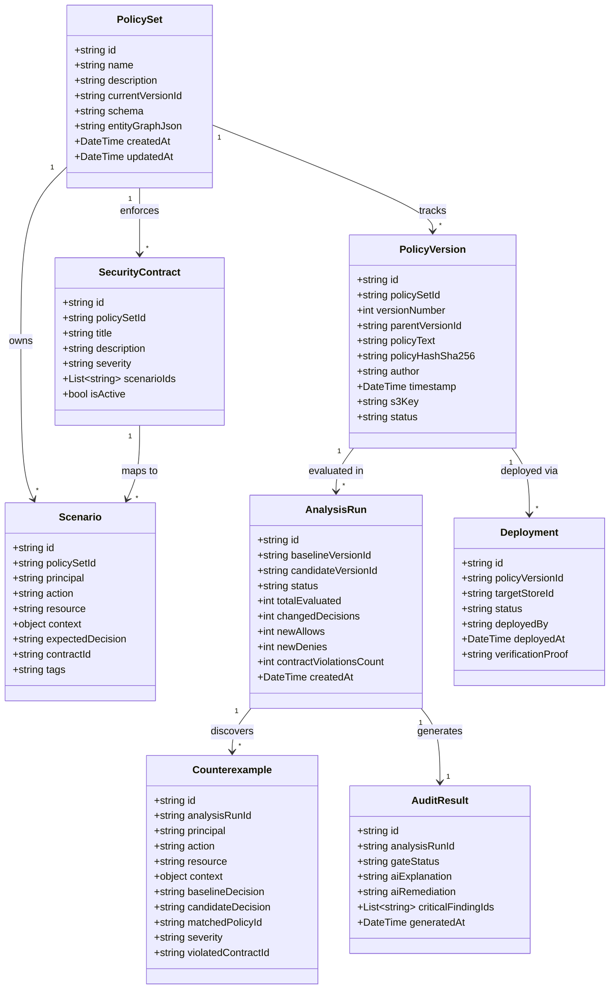
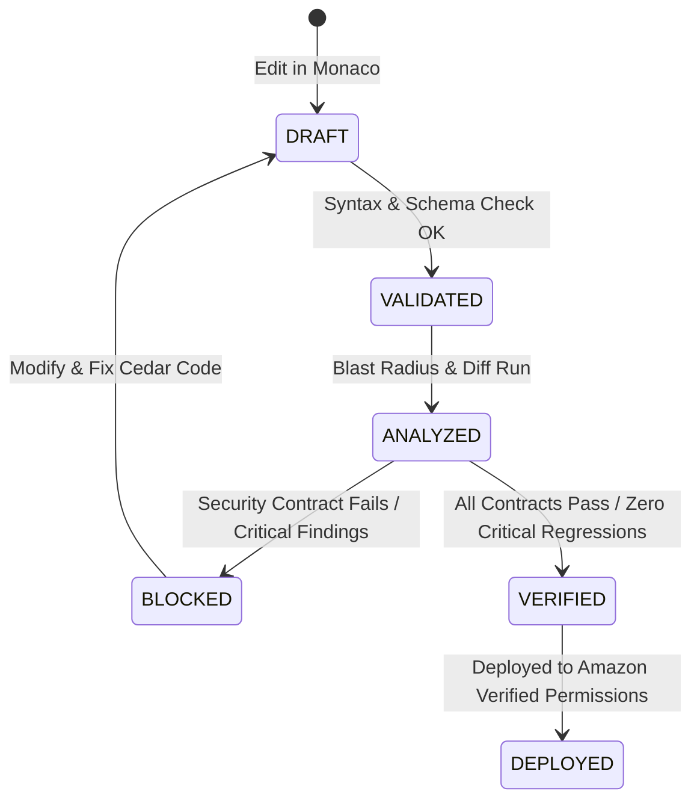
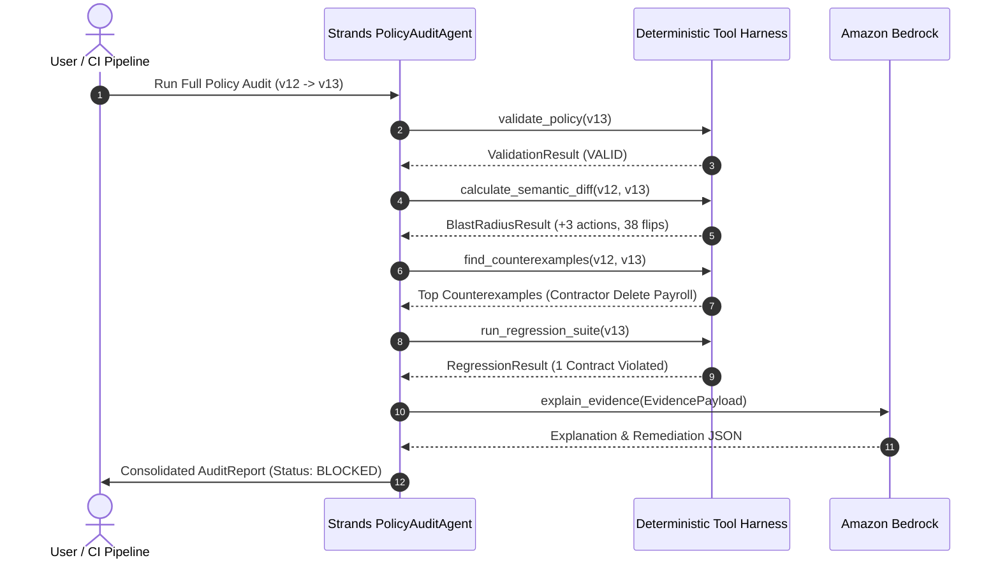

# PolicyLab — Technical Specification

**Version:** 1.0.0-draft  
**Status:** Authoritative Engineering Specification  
**Authors:** VibeSync (Vishal & Sneha)  
**Hackathon:** WeMakeDevs × AWS First Commit 2026  

---

## 1. Scope

This document specifies the internal domain models, data contracts, algorithms, evaluation interfaces, API endpoints, and system behaviors for **PolicyLab**. It serves as the authoritative blueprint for both developer implementation and AI coding agents during subsequent development phases.

---

## 2. System Responsibilities

The system is partitioned into three strictly separated tiers of responsibility:

```text
┌─────────────────────────────────────────────────────────────────────────┐
│ 1. DETERMINISTIC SECURITY LAYER                                         │
│ • Cedar AST parsing, syntax validation, and schema checking             │
│ • Scenario simulation and authorization decision computation            │
│ • Version hashing (SHA-256) and immutable artifact management           │
│ • Matrix evaluation of bounded scenario universes                       │
│ • Behavioral / semantic diff classification                             │
│ • Deterministic counterexample extraction and ranking                   │
│ • Security contract verification and regression test execution          │
│ • Pre-deployment gate policy evaluation                                 │
└────────────────────────────────────┬────────────────────────────────────┘
                                     │ Canonical Evidence
                                     ▼
┌─────────────────────────────────────────────────────────────────────────┐
│ 2. AI REASONING & SYNTHESIS LAYER                                       │
│ • Synthesizing structured evidence into natural language explanations   │
│ • Identifying root causes of permission drift and contract violations   │
│ • Recommending candidate policy remediations                            │
│ • Orchestrating multi-step audit pipelines (Strands Agents)             │
│ ⚠ AI NEVER EVALUATES ACCESS OR OVERRIDES DETERMINISTIC RESULTS           │
└────────────────────────────────────┬────────────────────────────────────┘
                                     │ Explanations & Reports
                                     ▼
┌─────────────────────────────────────────────────────────────────────────┐
│ 3. HUMAN OPERATOR & GOVERNANCE LAYER                                    │
│ • Interactive inspection of visual blast radius and counterexamples     │
│ • Reviewing deterministic evidence drawers                              │
│ • Approving policy modifications and suggested fixes                    │
│ • Triggering verified deployments to Amazon Verified Permissions        │
└─────────────────────────────────────────────────────────────────────────┘
```

---

## 3. Domain Model



---

## 4. Core Entities

### PolicySet
Root aggregate representing an application or service authorization boundary.
- `id`: Unique identifier (e.g., `ps_acmepay_01`).
- `name`: Human-readable name.
- `currentVersionId`: Reference to active production version.
- `schema`: Cedar JSON/DSL schema defining entity types and actions.
- `entityGraphJson`: Default entity store (users, roles, resources, memberships).

### PolicyVersion
Immutable record of policy source code at a point in time.
- `id`: Unique identifier (e.g., `pv_12`, `pv_13`).
- `policySetId`: Foreign key to `PolicySet`.
- `versionNumber`: Monotonically increasing integer.
- `parentVersionId`: ID of previous version (for lineage tracking).
- `policyText`: Raw Cedar policy definitions.
- `policyHashSha256`: Cryptographic digest of canonicalized policy text.
- `status`: `DRAFT` | `VALIDATED` | `ANALYZED` | `VERIFIED` | `DEPLOYED` | `BLOCKED`.

### Scenario
An explicit authorization test case.
- `principal`: Entity identifier (e.g., `User::"alice"` or `Role::"editor"`).
- `action`: Action identifier (e.g., `Action::"delete"`).
- `resource`: Resource identifier (e.g., `Invoice::"inv-42"`).
- `context`: Key-value attribute map (e.g., `{ "mfa_authenticated": true, "ip": "10.0.0.1" }`).
- `expectedDecision`: `ALLOW` | `DENY`.
- `contractId`: Optional reference to a parent `SecurityContract`.

### AnalysisRun
Record of a comparative evaluation between two versions.
- `baselineVersionId`: ID of reference version (e.g., current production `v12`).
- `candidateVersionId`: ID of proposed version (e.g., draft `v13`).
- `changedDecisions`: Count of scenarios where baseline $\neq$ candidate.
- `newAllows`: Count of transitions from $\text{DENY} \to \text{ALLOW}$.
- `newDenies`: Count of transitions from $\text{ALLOW} \to \text{DENY}$.

### SecurityContract
A high-level security requirement.
- `title`: Short summary (e.g., *"Contractors cannot delete invoices"*).
- `severity`: `CRITICAL` | `HIGH` | `MEDIUM` | `LOW`.
- `scenarioIds`: Array of scenario IDs that must all evaluate to expected decisions.

### RegressionTest
An executable suite grouping multiple security contracts and baseline scenarios.

### Counterexample
A deterministic authorization tuple demonstrating unexpected or dangerous behavior changes between versions.

### AuditResult
Consolidated audit outcome combining deterministic metrics and Bedrock analysis.

### Deployment
Audit trail of an applied synchronization to Amazon Verified Permissions.

---

## 5. Canonical Evidence Model

To guarantee that the frontend, AI layer, and audit orchestrators never invent or misinterpret authorization facts, all Cedar evaluations must emit the **Canonical Authorization Evidence** payload:

```json
{
  "evidenceId": "ev_8f12a9c4",
  "timestamp": "2026-09-19T08:30:00Z",
  "engine": "cedar-rust-wasm@3.0.0",
  "evaluationMode": "DETERMINISTIC",
  "request": {
    "principal": "User::\"contractor_alice\"",
    "action": "Action::\"delete\"",
    "resource": "PayrollReport::\"payroll_2026_q1\"",
    "context": {
      "ipAddress": "192.168.1.50",
      "isMfaVerified": false
    }
  },
  "decision": "ALLOW",
  "matchedPolicies": [
    {
      "policyId": "policy_editor_all_actions",
      "effect": "permit",
      "clause": "principal in Role::\"contractor\", action, resource in ResourceType::\"PayrollReport\""
    }
  ],
  "determiningPolicies": [
    "policy_editor_all_actions"
  ],
  "diagnostics": {
    "errors": [],
    "warnings": [
      "Broad action wildcard matched without conditional restriction"
    ]
  },
  "executionDurationMs": 1.42
}
```

### Why Canonical Evidence is Mandatory
1. **Zero AI Hallucination:** Amazon Bedrock prompts receive this exact JSON structure as immutable ground truth.
2. **Deterministic UI Rendering:** Evidence Drawers directly parse `matchedPolicies` and `determiningPolicies` without secondary backend calls.
3. **Audit Trail Verification:** Evidence records are stored in Amazon S3 and hashed for regulatory compliance.

---

## 6. Policy Version Model

Every policy modification triggers the version lifecycle:



### Canonical Hash Calculation
The `policyHashSha256` is calculated from normalized policy text:
1. Strip trailing whitespace per line.
2. Normalize line endings to LF (`\n`).
3. Sort policies deterministically by policy ID if multiple policies exist in the set.
4. Calculate SHA-256 over UTF-8 encoded bytes.

---

## 7. Authorization Scenario Model

A scenario represents a single point in the authorization vector space:

$$\text{Scenario} = \langle P \in \mathcal{P}, A \in \mathcal{A}, R \in \mathcal{R}, C \in \mathcal{C}, D_{\text{exp}} \in \{\text{ALLOW}, \text{DENY}\} \rangle$$

### Scenario Representation
```json
{
  "id": "sc_acmepay_contractor_delete_payroll",
  "policySetId": "ps_acmepay_01",
  "title": "Contractor delete payroll report attempt",
  "principal": "User::\"contractor_alice\"",
  "action": "Action::\"delete\"",
  "resource": "PayrollReport::\"q1_summary\"",
  "context": {
    "network": "EXTERNAL"
  },
  "expectedDecision": "DENY",
  "contractId": "contract_contractor_payroll_isolation",
  "tags": ["critical", "compliance", "p0"]
}
```

---

## 8. Cedar Evaluation Contract

The domain layer encapsulates Cedar evaluation through a pluggable interface:

```python
class ICedarEngine(ABC):
    @abstractmethod
    def validate_policy(self, policy_text: str, schema_json: Optional[str] = None) -> ValidationResult:
        """Validates Cedar policy syntax and schema compatibility."""
        pass

    @abstractmethod
    def evaluate(self, request: AuthorizationRequest, policy_text: str, entities_json: str) -> CanonicalEvidence:
        """Evaluates a single authorization scenario against a policy set."""
        pass

    @abstractmethod
    def batch_evaluate(self, scenarios: List[AuthorizationRequest], policy_text: str, entities_json: str) -> List[CanonicalEvidence]:
        """Evaluates a batch of authorization scenarios."""
        pass
```

Implementations:
- `LocalCedarAdapter`: High-speed local Rust-compiled binary or Python Cedar bindings for unit tests and local CLI.
- `AWSVerifiedPermissionsAdapter`: Direct integration with Amazon Verified Permissions `IsAuthorized` API for live production verification.

---

## 9. Semantic Diff Specification

PolicyLab categorizes changes across five orthogonal dimensions:

```text
┌────────────────────────────────────────────────────────────────────────┐
│ 1. Textual Diff     │ Line-by-line additions, deletions, replacements  │
├─────────────────────┼──────────────────────────────────────────────────┤
│ 2. Structural Diff  │ Added/removed/modified policy statements and IDs │
├─────────────────────┼──────────────────────────────────────────────────┤
│ 3. Semantic Diff    │ Effective permission changes per role/action     │
├─────────────────────┼──────────────────────────────────────────────────┤
│ 4. Population Delta │ Quantitative count: Δ Principals, Actions, Rscs  │
├─────────────────────┼──────────────────────────────────────────────────┤
│ 5. Behavioral Diff  │ Decision transitions (DENY→ALLOW, ALLOW→DENY)    │
└────────────────────────────────────────────────────────────────────────┘
```

### Behavioral Decision Transition Matrix
For each scenario $s$ in universe $\mathcal{U}$:

| Baseline ($v_{\text{old}}$) | Candidate ($v_{\text{new}}$) | Transition State | Security Classification |
|---|---|---|---|
| `DENY` | `ALLOW` | $\text{DENY} \to \text{ALLOW}$ | **Permission Expansion** (High Risk / Potential Breach) |
| `ALLOW` | `DENY` | $\text{ALLOW} \to \text{DENY}$ | **Permission Reduction** (Operational Risk / Breaking Change) |
| `ALLOW` | `ALLOW` | $\text{ALLOW} \to \text{ALLOW}$ | **Unchanged Access** (Stable) |
| `DENY` | `DENY` | $\text{DENY} \to \text{DENY}$ | **Unchanged Denial** (Stable) |

---

## 10. Blast Radius Specification

### Bounded Scenario Universe Approach
To provide deterministic, sub-second blast radius analysis without requiring infinite symbolic execution, PolicyLab defines the **Declared Scenario Universe** $\mathcal{U}$:

$$\mathcal{U} = \mathcal{P}_{\text{declared}} \times \mathcal{A}_{\text{declared}} \times \mathcal{R}_{\text{declared}} \times \mathcal{C}_{\text{standard}}$$

Where:
- $\mathcal{P}_{\text{declared}}$ = Set of principal entities and role archetypes from the entity store.
- $\mathcal{A}_{\text{declared}}$ = Set of actions defined in the schema (e.g., `view`, `edit`, `delete`, `export`).
- $\mathcal{R}_{\text{declared}}$ = Set of resources and resource hierarchies in the fixture.
- $\mathcal{C}_{\text{standard}}$ = Standard context permutations (e.g., internal vs. external network, MFA vs. non-MFA).

### Blast Radius Evaluation Algorithm
```python
def compute_blast_radius(baseline_version, candidate_version, universe, entities):
    expanded_permissions = []
    reduced_permissions = []
    affected_principals = set()
    affected_resources = set()
    affected_actions = set()

    for scenario in universe:
        before = evaluate(baseline_version.policy_text, scenario, entities)
        after = evaluate(candidate_version.policy_text, scenario, entities)

        if before.decision != after.decision:
            affected_principals.add(scenario.principal)
            affected_resources.add(scenario.resource)
            affected_actions.add(scenario.action)

            record = {
                "scenario": scenario,
                "before": before.decision,
                "after": after.decision,
                "determiningPolicy": after.determining_policies
            }

            if before.decision == "DENY" and after.decision == "ALLOW":
                expanded_permissions.append(record)
            elif before.decision == "ALLOW" and after.decision == "DENY":
                reduced_permissions.append(record)

    return BlastRadiusResult(
        delta_actions=len(affected_actions),
        delta_resources=len(affected_resources),
        delta_principals=len(affected_principals),
        newly_authorized=expanded_permissions,
        newly_forbidden=reduced_permissions,
        is_bounded=True,
        universe_size=len(universe)
    )
```

> **Explicit Boundary Statement:** Analysis is strictly bounded by the declared scenario universe and entity fixtures. It provides high-confidence empirical verification over declared workloads, but is not an unbounded formal mathematical proof over infinite states.

---

## 11. Counterexample Specification

Counterexamples are extracted directly from the subset of $\text{DENY} \to \text{ALLOW}$ transitions in the blast radius analysis.

### Severity Ranking Heuristic
Every counterexample is assigned a deterministic severity score:

$$\text{Severity Score} = w_a \cdot \text{Weight}(\text{Action}) + w_r \cdot \text{Weight}(\text{Resource}) + w_p \cdot \text{Weight}(\text{Principal}) + w_c \cdot \text{ContractMultiplier}$$

- $\text{Weight}(\text{Action})$: `delete` = 10, `export` = 8, `edit` = 5, `view` = 2.
- $\text{Weight}(\text{Resource})$: `PayrollReport` = 10, `CustomerRecord` = 8, `Invoice` = 6, `SupportTicket` = 2.
- $\text{Weight}(\text{Principal})$: `contractor` = 10, `viewer` = 8, `support` = 5, `admin` = 1.
- $\text{ContractMultiplier}$: If violates an active `SecurityContract`, multiply overall score by $2.5\times$.

Top-ranked counterexamples are highlighted as **Critical Security Findings** in the UI.

---

## 12. Security Contract Specification

Security Contracts define organizational invariants.

### Structure
```yaml
id: contract_editor_cannot_delete_invoices
title: "Editors cannot delete invoices"
severity: CRITICAL
invariants:
  - principal_type: "Role::editor"
    action: "Action::delete"
    resource_type: "ResourceType::Invoice"
    expected: "DENY"
```

### Evaluation Logic
A Security Contract passes if and only if **all** associated scenarios evaluate to their `expected` decision under the candidate policy version.

---

## 13. Regression Specification

The regression harness runs all defined Security Contracts and baseline authorization test cases against the candidate policy set.

### Execution Metrics
- **Total Scenarios:** $N$
- **Passed Scenarios:** Count where $\text{Actual} == \text{Expected}$.
- **Failed Regressions:** Count where $\text{Actual} \neq \text{Expected}$.
- **Regression Status:** `PASSED` (0 failures) | `FAILED` ($>0$ failures).

---

## 14. AI Evidence Contract (Amazon Bedrock)

Amazon Bedrock is invoked exclusively to explain deterministic findings.

### Input Prompt Structure
```text
SYSTEM:
You are an authorization security analyst explaining a deterministic verification finding produced by Cedar.
You must adhere to these rules:
1. Base your explanation strictly on the provided OBSERVED EVIDENCE.
2. Do not invent users, roles, actions, policies, or facts not present in the evidence.
3. Clearly separate observed evidence from your diagnostic interpretation and remediation suggestions.

OBSERVED EVIDENCE:
- Baseline Version: v12 (Decision: DENY)
- Candidate Version: v13 (Decision: ALLOW)
- Principal: User::"contractor_alice" (Role: "contractor")
- Action: Action::"delete"
- Resource: PayrollReport::"q1_summary"
- Changed Policy ID: policy_all_editor_actions
- Modified Clause: "action" (broad wildcard) replaces "action == Action::\"view\""
- Violated Security Contract: "Contractors cannot delete payroll reports"

OUTPUT FORMAT:
{
  "summary": "<1-sentence summary of the behavioral change>",
  "rootCause": "<Technical explanation of why the Cedar policy change caused this>",
  "securityRisk": "<Contextual explanation of the business/security impact>",
  "remediationCedar": "<Suggested Cedar policy snippet fixing the issue without breaking intended access>"
}
```

---

## 15. Strands Agent Specification

The `PolicyAuditAgent` uses the Strands Agents SDK to orchestrate comprehensive multi-tool verification workflows.



### Agent Tool Manifest
1. `validate_policy(policy_text, schema)`
2. `get_policy_version(version_id)`
3. `calculate_semantic_diff(v_old, v_new)`
4. `find_counterexamples(v_old, v_new)`
5. `run_regression_suite(version_id)`
6. `get_security_contracts(policy_set_id)`

> **Non-Autonomous Deployment Boundary:** The Strands agent can evaluate gates and produce recommendations, but cannot autonomously invoke the `deploy` tool without explicit human approval.

---

## 16. Deployment Gate Specification

The pre-deployment gate enforces a zero-trust promotion workflow:

```text
┌────────────────────────────────────────────────────────┐
│ PRE-DEPLOYMENT VERIFICATION CHECKLIST                  │
├────────────────────────────────────────────────────────┤
│ [✓] 1. Cedar Syntax & Schema Validation       PASS     │
│ [✓] 2. Semantic Diff & Blast Radius Computed   PASS     │
│ [✓] 3. Regression Suite (18/18 Scenarios)     PASS     │
│ [✓] 4. Security Contracts (6/6 Satisfied)      PASS     │
│ [✓] 5. Counterexample Review (0 Critical)     PASS     │
├────────────────────────────────────────────────────────┤
│ GATE STATUS: READY FOR DEPLOYMENT                      │
│ [ Deploy Verified Version to Amazon Verified Permissions ]│
└────────────────────────────────────────────────────────┘
```

If any check fails:
- Gate status is marked `BLOCKED`.
- The deployment action is hard-disabled.
- The reason and violated contract IDs are displayed in the deployment ledger.

---

## 17. API Contract

### Overview of Endpoints

| Method | Route | Description |
|---|---|---|
| `POST` | `/projects` | Create a new PolicySet project workspace |
| `GET` | `/projects/{id}` | Retrieve PolicySet metadata and active version |
| `POST` | `/policies` | Save a new draft or policy version |
| `GET` | `/policies/{id}/versions` | List version history for a PolicySet |
| `POST` | `/policies/{id}/validate` | Validate syntax and schema of a Cedar policy |
| `POST` | `/simulate` | Run an ad-hoc authorization scenario |
| `POST` | `/diff` | Compute textual, structural, and semantic diff |
| `POST` | `/analyze` | Compute blast radius and extract counterexamples |
| `POST` | `/audits` | Trigger an orchestrated Strands audit run |
| `GET` | `/audits/{id}` | Retrieve audit run findings and Bedrock summary |
| `POST` | `/regression/run` | Execute regression test suite against a version |
| `POST` | `/explain` | Generate Bedrock natural language explanation |
| `POST` | `/deploy` | Deploy a verified policy version to AVP |

---

## 18. Error Handling

All APIs return standardized error payloads:

```json
{
  "error": {
    "code": "SECURITY_CONTRACT_VIOLATION",
    "message": "Policy version violates active security contract: SC-04",
    "details": {
      "contractId": "contract_editor_cannot_delete",
      "failedScenarioCount": 2,
      "gateStatus": "BLOCKED"
    },
    "requestId": "req_81b94df0"
  }
}
```

Standard Error Codes:
- `INVALID_CEDAR_SYNTAX`: Policy compilation error with line/column details.
- `SCHEMA_VALIDATION_FAILED`: Policy references undeclared entity types or actions.
- `VERSION_NOT_FOUND`: Referenced policy version does not exist.
- `DEPLOYMENT_GATE_BLOCKED`: Attempted deployment on unverified or failing policy version.

---

## 19. Logging and Auditability

1. **Deterministic Execution Logs:** All Cedar evaluation invocations record timestamp, scenario hash, and matched policy IDs.
2. **Cryptographic Trail:** Policy versions are tagged with canonical SHA-256 hashes.
3. **AWS CloudWatch:** Structured JSON logging across all Lambda microservices.

---

## 20. Testing Requirements

- **Unit Tests:** Cedar parser, canonical hash generator, blast-radius categorization matrix, and counterexample severity ranker.
- **Integration Tests:** End-to-end flow from API Gateway $\to$ Lambda $\to$ Cedar Engine $\to$ DynamoDB persistence.
- **AI Grounding Tests:** Bedrock prompt validation ensuring output strictly quotes supplied scenario IDs and entity names.
- **Deployment Gate Tests:** Verifying that failing contracts unconditionally reject deployment calls.

---

## 21. Acceptance Criteria

1. **AcmePay Scenario Validation:** Successfully detects the accidental `action` expansion in AcmePay v13, flags the contractor delete payroll counterexample, fails the security contract, and blocks deployment.
2. **Sub-second Response:** Interactive scenario simulator responds in $<100\text{ ms}$.
3. **Immutability:** Modifying an existing version ID is impossible; every edit creates a new hashed version.
4. **Verified Permissions Synchronization:** Validated policies are correctly written to the target Amazon Verified Permissions Policy Store.

---

## 22. Implementation Constraints

- Backend runtime: Python 3.11+ / FastAPI / AWS Lambda.
- Frontend: React / TypeScript / Vite / Tailwind CSS / Monaco Editor.
- Zero client-side AWS credentials: All cloud communication routed through authenticated API Gateway endpoints.
- Total offline fallback: Core deterministic engine runnable via local adapters without active internet or AWS credentials.
